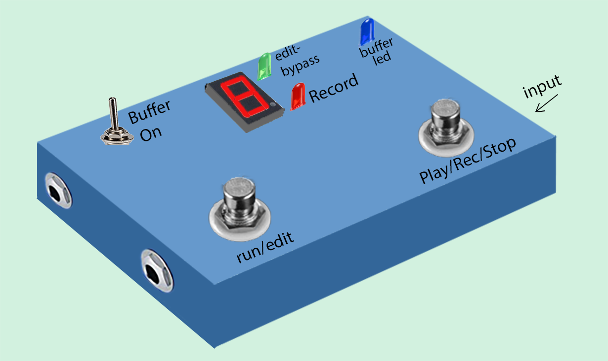

#### About
This guide describes the switches and input/outputs of the looper, and how to use them to record tracks, deleted or un-delete tracks, use the buffer and use the True Bypass.

#### Looper box model
Although the final design will vary slightly, or your enclosure may be different, this image is a good representation of the Looper with Buffer [Integrated version](/Looper/How-to-Build-it-design-options/).

#### Design

The Looper contains the Raspberry Pi which must be powered by a 5V 2.5-3 Amp adapter. 
The enclosure also contains a completely separate Buffer powered by a separate 9 Volt battery.  

#### Input/Outputs

##### Looper + Buffer

- Plug you instrument in the  1/4 inch input jack (not shown) located on the right side of the enclosure.

- Plug your amplifier (or next pedal in a chain) on the Looper output jack - which is located on the left side nearest the bottom of the enclosure near the switch labelled "run/edit".

##### Buffer only

It is possible to use this pedal only as a buffer pedal - to act as a Direct Input (DI) box - for example to feed a computer program or iphone).  

- Same as above - Plug you instrument in the  1/4 inch input jack (not shown) located on the right side of the enclosure.

- The Buffer output is the 1/4 inch jack located on the left side of the enclosure, near the switch labelled "Buffer On.

- Turn on the buffer with the Buffer On switch.  The Blue LED in the top right corner will be lit.  This indicates that the buffer is drawing power from the 9V battery.

##### Type of Inputs - Can I plug my guitar directly in?

The looper tuns a Raspberry Pi which uses a sound card "mic" input to get the music you want to record.  Just like your computer - as explained in the [introduction)[/Looper/How-to-Build-it-Introduction/] - if you plug in the guitar directly - the result is poor tone. 

But since a buffer is included - you can plug the guitar directly in the input of the Looper, and turn on the buffer (with the Buffer-On switch).  

If The Buffer On switch is off, the input is fed directly to the Looper sound card internally.  In this mode, you should have plugged in a DI box, or the output of a buffered pedal (like BOSS), or the output of a multi-effects.  Some amplifiers have an analog signal output that can also be used in this mode.

#### Switches description

##### Buffer On Switch  
- In the ON position, the buffered is powered (from the 9V battery), feeds the input jack signal to the buffer which creates the buffered signal. The switch h then steers this buffered signal to the internal Looper sound card.  
- In the Off position, the buffer is off (battery draws no power) and the input jack signal is steered directly to the Looper internal sound card.

##### Mode switch: Run-Edit

The run-edit mode switch is used to put select the mode of the Looper.

- Run mode:  
    - The green LED is Off. The Looper sound card output is fed to the Looper Out jack.
    - You can use the Play-Rec-Stop switch to record tracks, play and stop the loop
    - The displays shows the number of tracks recorded in the loop. If there are zero tracks a "-" is displayed.
    - The display is **NOT** flashing

- Edit (bypass) Mode:
    - The green LED is On.  This puts the Looper in True Bypass mode. (Input guitar jack is fed directly - via wires - to Looper output jack)
    - The displays flashes the number of tracks recorded in the loop
    - The Play-Rec-Stop switch is used to deleted or undelete tracks, or to turn off the RAspberry Pi Looper correctly.

##### Play-Rec-Stop switch - Looper in Run Mode:

While in run loop, your looper will be in one of three states:
- ***Idle***:  
    - The Looper is not playing the loop. However, if you play your instrument, you will hear it.
    - The number of recorded tracks in the loop is shown on the display.  If there are zero tracks a "-" is displayed.
- ***Recording***: 
    - The Looper is recording what you are playing.  
    -  The red LED is lit.
    - If this is ***not*** the first track (base loop), the displays shows a countdown from 9 to 0 showing where you are in the loop (9 = beginning, 0 = end).
    - If you are recording the first track (base loop) the display is dark.
- ***Play***: 
    - The looper is playing all the recorded tracks in the Loop.  You can hear the tracks playing via amplifier connected to Looper output.
    - The displays shows a countdown from 9 to 0 showing where you are in the loop (9 = beginning, 0 = end).
    - the red LED is off (not lit).
    - You can play your instrument and you will hear it mixed in to the recorded tracks being played - but it is not being recorded.
    - The loop restarts automatically when it gets to the end, until you stop it.

This switch can be hit once( single tap), or twice in succession (double-tap: like a double-click)

- If the looper is in ***idle*** and there are ***zero*** tracks in the looper ("-" is displayed):
    - A single tap starts recording the base loop (track #1)
    - A single or double tap stops recording - and puts the looper immediately in Play mode (you hear what you just recorded from the beginning)

- If the looper is in ***idle*** and there is ***at least one*** track in the looper (number of tracks is displayed):
    - A single tap starts playing the loop from the beginning (looper goes to ***Play*** state)

- Once the looper is Playing (in ***Play***) mode:
    - A double tap stops Playing the loop - and puts the looper back to ***idle***.
    - A single tap starts recording ***at the position where you are in the loop*** - Looper is now in ***recording*** state.

- Once the Looper is ***recording***:
    - A single or double tap stops the recording.
    - The Looper goes immediately in ***Play*** state. The display shows the track count which is now one more than before.
    - If the track recorded was***not*** the first track - the looper plays on from where you are in the loop. 
        - When it gets to the end of the loop it will go back to the beginning and you will hear the newest track you just recorded.
        - If the loop is long enough it is possible to record two tracks (or more) at different time in the loop by single tapping to start recording, single tapping to stop, single tapping to start recording another track and single tapping to stop - while the loop keeps playing the previously recorded tracks.
    - If the track you just recorded was the first track (base loop) - the Looper starts to play the recorded track from the beginning as soon as you stop recording.

###### Visually - Looper has no tracks:

Looper is ***idle*** -> "Single Tap" -> start recording -> "Single Tap" -> stop recording - Looper plays recording -> "Double Tap" -> stops playing (***idle***)

###### Visually - Looper has at least one track:

Looper is ***idle*** -> "Single Tap" -> start playing loop -> "Single Tap" -> starts recording -> "Single Tap" -> stop recording-  Looper goes back to Play from this point in time in the loop -> "Double Tap" -> stops playing (***idle***)

###### Visually - Looper has at least one track - multiple record in one loop:

Looper is ***idle*** -> "Single Tap" -> start playing loop -> "Single Tap" -> starts recording -> "Single Tap" -> stop recording-  Looper goes back to Play from this point in time in the loop ->   
-> "Single Tap" -> start playing loop -> "Single Tap" -> starts recording -> "Single Tap" -> stop recording-  Looper goes back to Play from this point in time in the loop  ->
"Double Tap" -> stops playing (***idle***) 

##### Play-Rec-Stop switch - Looper in Run Mode:

When the Looper is in edit (bypass) Mode The switch is used to delete or un-delete tracks as explained in details (Looper's Principles)[/Looper/How-To-Use-principles/].

- Single Tap:  Deletes the last recorded track from the loop.
    - Flashing track count display will be reduced by 1.  
- Double Tap:  Restores (un-deletes) the last recorded track to the loop.
    - Flashing track count display will be increased by 1.  

##### Important - Turning OFF the Looper.

It is important to remember that the Looper is running on Raspberry Pi - which is a computer running Linux.  And like other computers running windows or MasOS - the computer needs to be shut down properly to ***prevent damage to your recordings***.

***DO NOT UNPLUG*** the Looper to turn it off.

> Technical stuff:  The recording are stored as relatively large .wav files on the sd card on which you installed the software.  If you pull the power cord before shutting down the Raspberry Pi correctly, the SD card can become corrupted:  you would not only loose your audio files, but you may find that the Looper never restarts because the software is corrupted.  You would have to install everything anew - and possibly would need a new SD card.

###### How to turn off the Looper:
- Put hte Looper in edit (bypass) mode using the mode switch. Green LED will turn On (lit).
- Press and hold the "Play-Rec-Stop" switch for 3-4 seconds - until the display goes dark and the green LED shuts off.
- Wait another 5-10 seconds to give time to the Raspberry Pi Linux operating system to shut itself down fully
- at this point - and only at this point - you can unplug the Looper if you wish (you do not have to).

###### How to run on the Looper after it was turned off:

If you turned off the Looper correctly and unplugged the looper from its power adapter - simply plugging it back in will start the Looper.  

If you did not unplug the Looper, you only need to single tap the mode switch (run-edit) ***once only*** and the Looper will restart.

> Whether you plug it in, or single tap the mode switch, it will look like nothing is happening:  It usually takes up to 10 seconds for Linux/Raspberry Pi to wake up. (sometimes more if you installed other software on the raspberry pi  

> After this time, the display will wake up first and display the letters L - O - O - P  in a scrolling manner.  This indicates that Raspberry Pi is "awake" and the necessary start up programs for the Looper are happening.  

> After a while, the letters (LOOP) will stop scrolling - you will see a random pattern followed by the track count in the looper (or "-" if there are zero tracks.)  when this appears, the Looper is ready to go.

