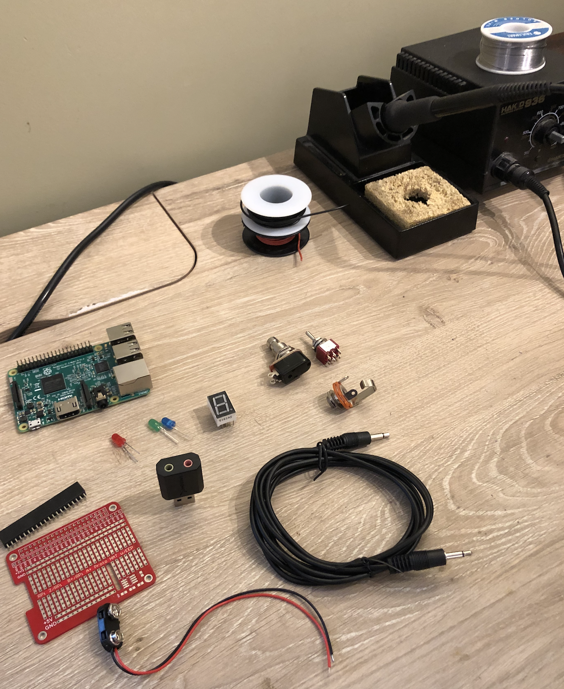
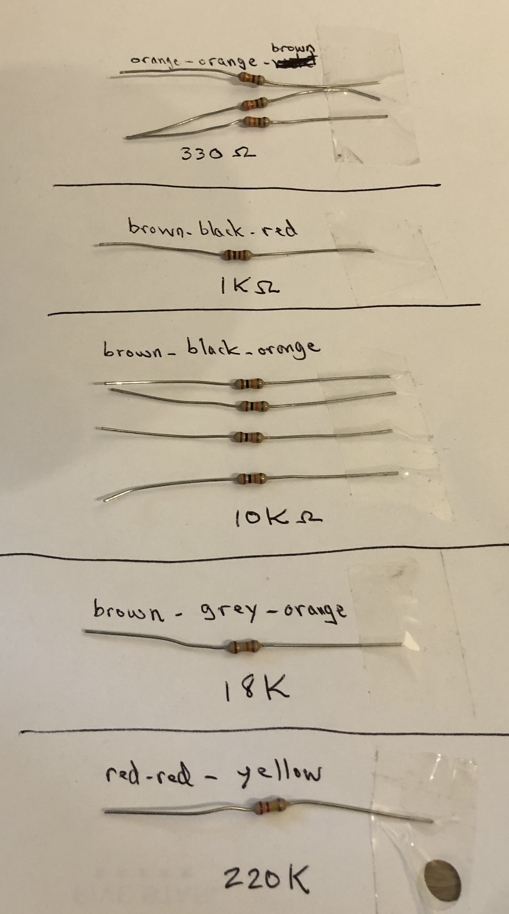
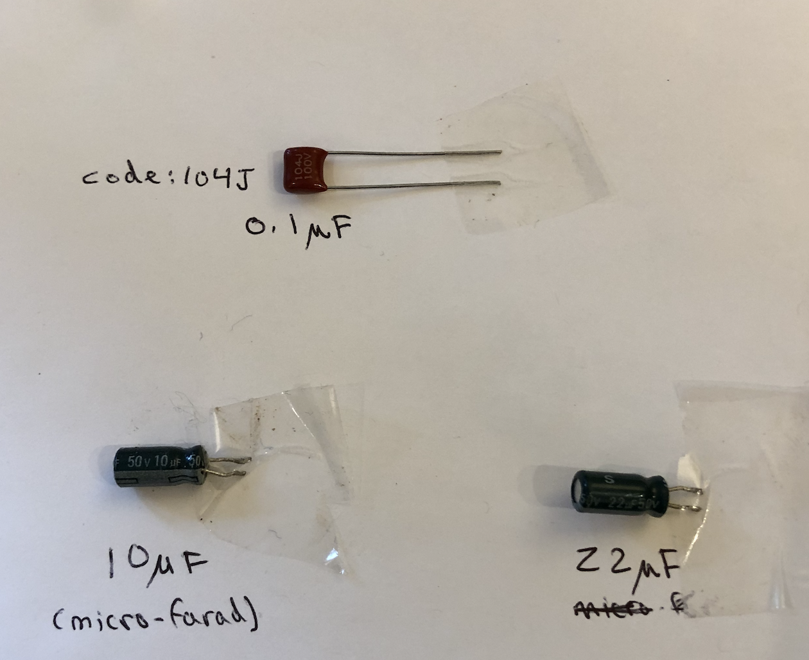
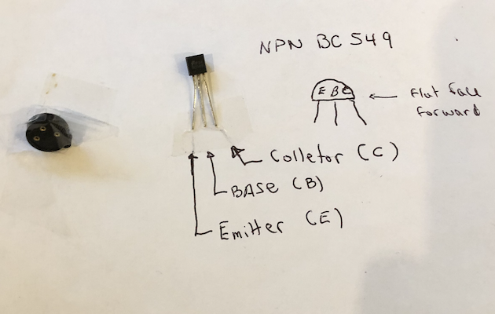

This might be a long page - I will assemble the circuits and take lots of pictures.  Hope it is useful...

>Note: this shows how to build the Looper+Buffer option.  If you are not building the buffer, refer to the schematics for what you don;t need to build (I'll mention below as I go)
> For the buffer: I am also building the option with one female 1/4 inch guitar jack input and a wired 3.5 mm output male output jack

####Getting the Parts ready

I recommend getting all the parts laid out, labelled where necessary before starting.  I have a wooden desk that I dedicated to electronics.  If you look carefully, you can see some burnt spots from solder/soldering iron.  I do recommend you don;t do this on your Louis XIV antique table ... but to each his own.

##### General Parts

- top left: Raspberri pi 3b+
- row underneath RPi, left to right:
    - red, green, blue LED
    - 7 segment commonde cathode LED
    - push-on momentary stomp switch
    - on-off-on DPDT toggle switch
    - underneath the switches: 1/4 inch mono female jack
- next row underneath:
    - RPi prototyping breadboard hat and its black connector (comes with it)
    - Sabrent usb sound card (grenn input is mic, pink is headphone)
    - 3.5mm mono male to male wire connector (I will cut this in two and only use one for the buffer output)
    -below red breadboard:  9V battery connector with leads.
- top right:
    - 2 spools of solid copper wire it's either 18 or 20 gauge.  I use a red and a black because I like to identify red leads that go to VCC (3.3V) and black leads that go to ground. But that is not important.
    - solder iron.  A while back I invested in a nice one with temperature control, but it's a bit overkill for this project.  A standard solder iron is just fine.  Make sure you get a sponde though.

##### Small Electronics components

I don't know about you - but my small electronics component do not like my table, and at the first opportunity they jump off and go hide under the counch or the bookcase.  So over the years I have learned that if I take 5 minutes to identify them, and tape them to a pieace of white paper - I save a lot of time later.

For this build I also added information for the reistor color code (in case one does jump anyway - I can figure out which one it is). For the capacitor, I worte down the number/letter code. For the transistor, I wrote the location and name of each pin.

Resitors

---

Capacitors

---

transistor

>Note: Since I had one left, I show on the left of the transistor a transistor socket.  It is not necessary, but it makes it easier to solder, without having to worry about getting the transistors leads to hot (which can damage the transistor).  I did not use one in my first prototype and everything was fine.  You don't have to use one. 

---

