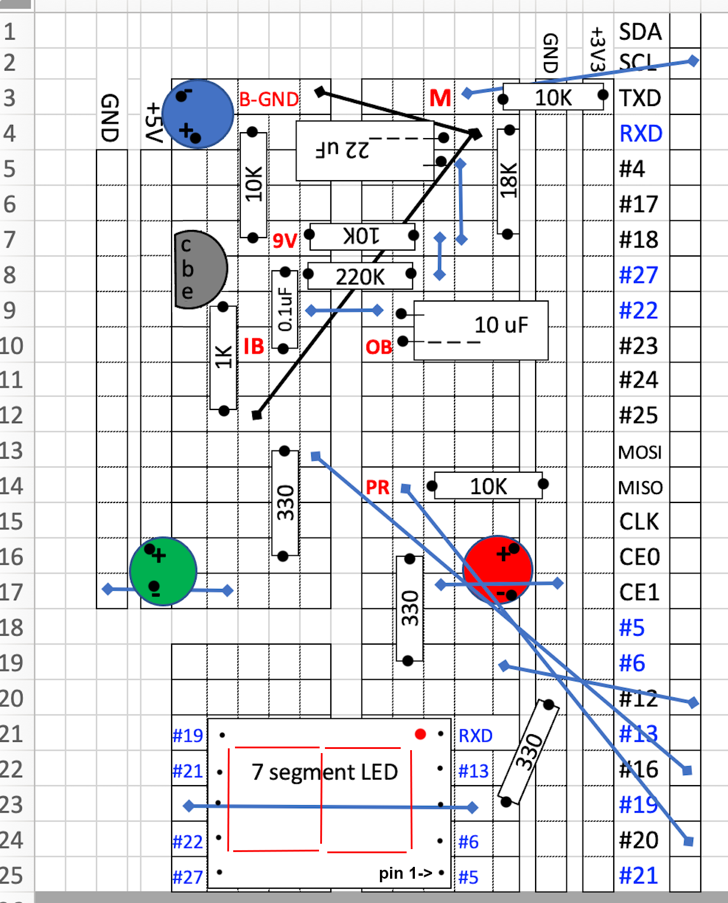
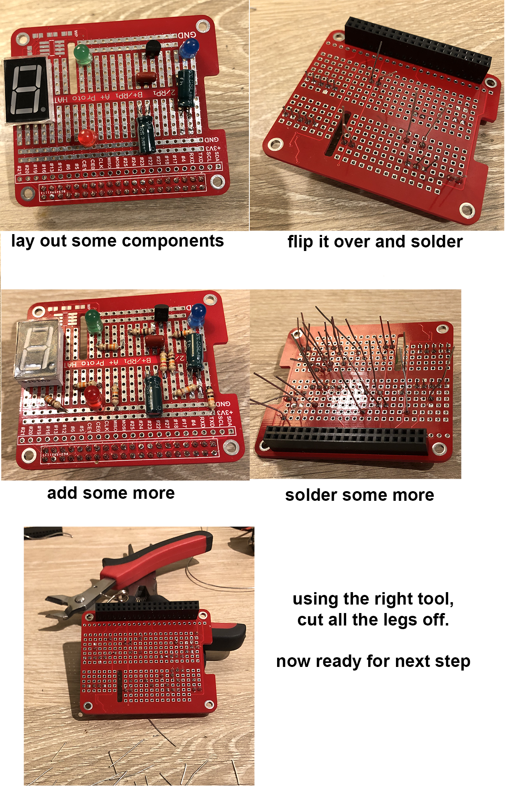

These assembly instructions are for the Looper Pedal with buffer Option.  There are other [options](/Looper/How-to-Build-it-design-options/#sectionTop),
but they are simpler so you should be able to remove what you don't need from this page and still build your selected option.

##### Step1: Select what board you are using.

This pages covers details of the assembly for RPI HAT Proto board and Looper PCB:

1.  RPI HAT Proto board:
    - This was my second implementation - and works fine - just a bit longer and finicky to assemble
2. Looper PCB: I designed and had made a PCB for the Looper Pedal with buffer Option. 
    - I can mail this to you for a small fee (cover my costs) - leave a message below if you are interested.
3. Bare breadboard:
    - If you are using the bare breadboard - you will do your own layout and assembly.  I suggest you look at the RPI HAT section to identify the wires that come off board (or use the schematics).  When your board is ready - skip to Step 4 - ofr the switches wiring.

##### Step2: Get the Parts ready

I recommend getting all the parts laid out, labeled as necessary before starting.  Have a tray reserved for the parts.  This may sound silly but ... when there are no parts you are done.  If a part is left... (you forgot something)

> Do not worry if you see slightly different resistor and capacitor values used in the picture as compared to the current state of the schematics.  I have built a few prototypes and have modified the values sometimes from when I took the pictures.  Also - sometimes I run  out of something and I will use the nearest value available - and in most cases it does not affect performance very much.

#### 2.1: General Parts

(Note: this picture shows the RPI Proto Hat - replace with Looper PCB if you have it - everything else is the same.)

- Top left: Raspberry pi 3b+
- Row underneath the Raspberry Pi, left to right:
    - red, green, blue LED
    - 7 segment common cathode LED
    - push-on momentary foot stomp switch (Play/Rec/Stop switch)
    - Latching foot stomp Mode switch (Run/Edit) - schematics calls for 2PDT - I used 3PDT since I have them.
    - 3PDT Toggle Buffer On Switch
    - underneath the switches: 1/4 inch mono female jack x 3
- Next row underneath:
    - RPi prototyping breadboard hat and its black connector (comes with it) (you can use Looper PCB if you have it)
    - Sabrent usb sound card (pink input is mic, green is headphone : check instructions! this may vary)
    - 3.5mm mono male to male wire connector (I will cut this in two to get the two that I need)
    -Below the red breadboard:  9V battery connector with leads.
- Top right:
    - 2 spools of solid copper wire - 20 gauge.  I use a red and a black because I like to identify red leads that go to VCC (3.3V) and black leads that go to ground. But that is not important.
        -Note: I use it because I have it. I would recommend getting 22 gauge wire - it is a bit less stiff and easier to work with/move around during final assembly.
    - Solder iron.  20 years ago I invested in a nice one with temperature control, but it's a bit overkill for this project.  A standard solder iron is just fine.  Make sure you get a sponge though - to clean the tip often...
    > Sad news - after 20 years, the transformer burned out in my solder station.  The cost of a new transformer is pretty much that of a new station.  I did not want to spend another $100 on this - so I just got a $20 no-name 40W solder iron at home depot.  It is just fine.  You DO NOT need a fancy work station for this kind of thru-hole soldering.

##### 2.2 Small Electronics components

I don't know about you - but my small electronics component do not like my table, and at the first opportunity they jump off and go hide under the couch or the bookcase.  So over the years I have learned that if I take 5 minutes to identify them, and stick them into a white sheet of paper - I save a lot of time later. (some people like to tape them down with scotch tape - not a bad idea...)

I also added information for the resistor color code (in case one does falls of the table anyway: I can figure out which is which). 

>Note: the component labeling (R1-R10 etc.) is used only on the Looper PCB.  For the RPI HAT - you will see below, I label the components using their value on the layout sheet.  

> ***WARNING: Transistor pin-out:*** The above pin-out with flat face up of C-B-E applies to the transistor BC549.   If you are using a transistor that starts with 2N... instead of BC... then the pinout is reversed (flat face left to right would be E-B-C).  I strongly recommend that you download the datasheet of the transistor you are using (if not using BC549) - and check what pin-out applies.  It is confusing because all these transistors are offered in the same T0-92 plastic package (with flat-face), yet the pin-out is not consistent between various series...

---

##### Step 3:  Layout/soldering of components

General Instructions: 
- Solder all electronics components on the board first - before soldering any wires that go off-board to switches and jacks.
- Solder components by order of thickness (which I did not do in the pictures for the RPI HAT!!!).  Thinnest components go down first. This way when you turn the board over to solder, they are pushed against the board and do not move on you...  Resistors will go first, LED will go last.
- Solder only 3 or 4 components at the time, then cut their legs off before doing the next batch. It's easier to work that way.  

##### 3.1A: Using Looper PCB

Everything is laid out on the board - and numbered.  The numbering - such as R1, C1, D1 etc. corresponds to the [schematic](/Looper/How-to-Build-it-circuit-schematics/#sectionTop) - so you can refer to it in order to figure out which part does where.  

>If you put all the small electronics components on a sheet per the picture above - you have already labeled the components - so not need to refer to the schematics while soldering.

All you have to do is bend the leads of the parts that need it - drop them in the holes of their location - turn the board over and solder them.

>  I know it's obvious but: make sure you place the 40 pin connector under the PCB - and solder the pins from the top. (not shown above)

>Transistor: the drawing on the PCB shows the flat part of the transistor (aiming left - when 40 pin connector is at bottom.) The pin are labeled c,b,e for collector base and emitter.  If you are using the BC549, the part is drawn correctly and facing the flat part to the left puts the pins in the correct position.  However - if you are using a 2Nxxx part - you will have to face the flat face to the right (opposite the outline on the pcb board) - in order for the C-B-E order to match.  They key part to remember is what ever is the Collector pin on your transistor - it must go into the hole labeled C. 

##### 3.1B: Using the RPI HAT proto board.

I learned a while back that you should layout all your parts before soldering. Do to this I print a grid that is roughly to scale and place all my components.  In our case - the RPI HAT has columns and rows that form connector strips so I try to indicated those on the grid.

How do connections work:

There are rows or columns of holes connected by lead/tin (silver color). These are connection strips.  If two components have a leg soldered to two holes in the same strip - they become automatically connected (like putting a wire between them on the schematics). 

The trick is to try to layout the components to fit in the smallest space possible, and use these connecting columns and rows as much as possible.  

> Some busses are labelled: you will see rows labeled GND and +3V3. this means that once we plug the RPI HAT into the Raspberry Pi (via the 40 pin connector) - that entire row will carry either ground (GND) or 3.3Volts (VCC on schematics).  So any component connected to one of these rows is effectively connected to either ground of VCC - per schematics.

#### 3.1B-1 RPI HAT Layout

This is the layout I came up with. Feel free to use it. I guarantee it matches the schematics.  However, I cannot say that it is the most optimized in terms of maximizing the use of busses and minimizing the number of wires needed to connect everything.  Feel free to improve it - and let me know if you come up with a better one so I can post here.

The layout is constructed using a square grid.  Individual Squares on the layout grid corresponds to a hole on the RPI Hat circuit board. Orient your board to match the layout.  

A drawn rectangle containing a number is a resistor or non-electrolytic capacitor, and the small black dots where the box starts and ends represents the holes(grid squares) where the resistor/capacitor leads go into.  

LEDs are shown as circle of the color that match the LED.  Pay attention to the + and - orientation (to go in the correct hole underneath). The anode ( + terminal) has the longest leg of the LED.

> The grid does not show the 40 pin connector.  The last grid column (right)  shows the labelled GPIO holes to solder to.  

> Note that you do not solder any wires to the connector.  The RPI HAT proto board has PCB copper traces that connects the labelled row of GPIOs to their actual pin on the connector. You solder your wires to the row (column?) of GPIO labeled holes and the 40 pin connector connects those point to the corresponding RPI GPIO.  Note also that this particular board labels the pins sometimes with their BCM naming number - sometimes with their BCM Pin role. For example BCM15 (GPIO15) which we need for the 7-Segment is labeled RXD.  I have used the RPI HAT Proto board pin labeling on the grid layout.  (refer to the GPIO naming section of the [schematic](/Looper/How-to-Build-it-circuit-schematics/#sectionTop) to see BCM pin numbers and pin roles).  

Electrolytic capacitors are meant to be laid flat on the board - because of clearance issues - and their footprint on the board represents the space needed.  Two leads come out of the "capacitor box" on the layout to indicate the hole where they should be soldered.  Pay attention to the negative lead indicated by three minus signs (- - -) on the box drawing. This corresponds to the negative markings on the electrolytic capacitor can.

The 7-segment LED should be oriented so that the "dot" is nearest the Red LED

Transistor - see note above under Looper PCB section on how to insert it (especially if you are using  a 2Nxxx transistor instead of BC549)

Squares which contain a red letter code indicate that an insulated wire must be connected to that hole - and the other end of the wire connected to a point off the board (typically a switch or an input/output jack)  - see next section.

 Connections not made by connector strips:

Since it is note possible to have all components only connected through strips, the layout uses insulated short wires from one strip to another to complete a connection.  These are the black and blue lines on the grid.  They connect the strip (and any component that ends on that strip) to another point on the board.  Just measure the actual length on the board and cut a wire - leaving just enough extra to go through the hole so you can solder on the other side. Strip the wire just enough so the insulation is almost flush to the board once the wire is inserted in the hole (to prevent wires from connecting to each other when they should not). I have run most of all my wires on the top of the board - but when needed for physical space - I run them  below.

>Warning - Use ***insulated*** wires.  It bears repeating the obvious: the connection wires must have insulation since they run over the connector strips and cannot make contact with those (until they get to the point where they connect).

Here is a sequence of photos - illustrating the process.

Soldering the connector first - I stuck a spare connector on the other side of the board to give me a stable platform - then solder all 40 pins.  *** After I was done I realized you should do this last ***

Then start adding the electronics components in their correct location and solder.

> You can cut legs as you go - to make it easier to solder more components.  

Once all the components are soldered to the board,  start laying out the connecting wires to connect the components on board.  Do not layout wires going off board yet.  If it is too tight on top - you can run some underneath (just be careful while soldering on top to not touch the iron to existing components or other wires (melting their insulation).

At this point the board is ready to move to the off board connections.

#### Step 4: Off Board connections

You now need to solder wires to the board that need to go off board to switches, jacks,  battery etc.  To do this - you need to have an idea of the box you will use and where you will feed the wires.  

There is one constraint: The Raspberry Pi edge that has the power connector must be flat against one side of the box - so a simple hole will allow for the power connection. 

> I suggest you lay out the components how you want them in the box until they fit. Don't forget that you have 3 dimensions. For the case I will be doing in 3-D printing - I put the battery below the RPI (there will be an access door).  This raise the RPI allowing me to slip the input jack under it.

> Also: don't forget the usb soundcard and the wires that plug into it.  Use the 3.5 mm male mono jacks from the parts lists and plug them into the usb sound card - when you are laying out your components i your box.

> As you can see, it can fit inside an older type iphone box (the thick ones).

Since the back of the board has the RPi power connector - I decide to route all off board going wires to the right and under the RPi. At this point I was able to measure and see that about 7 inches long for each wire would allow me to connect to the various switches/ jacks etc.

Looking at the schematic - here are the wires that need to go off board. For the Looper PCB - there are connections points already labelled on the right edge of the board.  For the RPI HAT - you have to reach the point where they are on the board.

>for the RPI HAT Proto Board - the connection point are labeled in red on the layout drawing above

| schematic name | name on Looper PCB | name on RPI Hat Proto | connects to: |
|:-----:|:-----:|:-----:|:-----|
|GNDREF|RPI GND|GND strip|Run/Edit Mode Sw pin1|
| | | | |
|BCM3 | BCM3 | M |Run/Edit Mode Sw pin2|
| | | | |
|BCM17|BCM17| PR |Play/Rec/Stop Sw pin1|
| | | | |
|VCC|VCC| +3V3 strip|Play/Rec/Stop Sw pin2|
| | | | |
|Buffer OUT| Buffer OUT | OB |Buffer On Sw pin9|
| | | | |
|Buffer IN | Buffer IN| IB|Buffer On Sw pin6|
| | | | |
|Switched 9V|Switched 9V| 9V |Buffer On sSw pin3|
| | | | |
|GND (buffer)| Batt Neg - GND | B-GND|Battery negative|

There are other connections to be made - but they are between switches/jacks etc. - not coming off the PCB proper.

#### Jacks/Switches/Battery connection drawing:

These are all the wire connections required.

Special Case for sound card: 

You will recall in the parts list, two male 3.5 mm mono jacks are needed to connect to the sound card - ans I suggested you buy one male to male cable and cut it in two.

- Now cut the cable to length (5-6 inches is needed), so you have two male jacks.  
- Then cut out the stress relief around the jack (to shorten it - Be careful not to cut the very small wire...) See picture on above wire harness of the result.  
- With an ohmMeter, identify which wire connects to the sleeve and which wire connects to the tip.  In mine: white = tip and red = sleeve - but yours could be different (so check with ohmMeter).
- The sleeve wires (here red) correspond to the ground of the jacks and need to be connected as shown on harness drawing:  
    - mic jack ground goes to input jack ground
    - headphone jack ground goes to pin 4 of run/Edit switch (this prevents ground loops)
- the tip wires, as shown above: 
    - for the sound card mic input, connect to pin 8 of the buffer On switch
    - for the sound card headphone out, connect to pin 7 of the Mode Run/Edit switch.

Here are the finished results:
- RPi HAT Proto (red) shown without the sound card inserted in RPi.
- Looper PCB (V1 - green) shown with the sound card inserted into RPi.  

