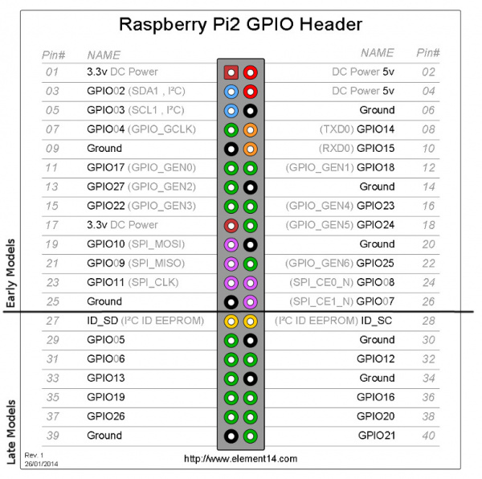
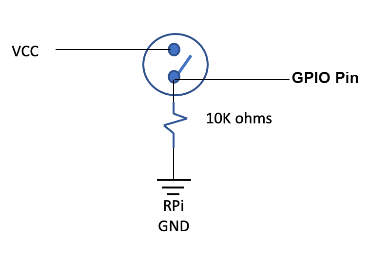
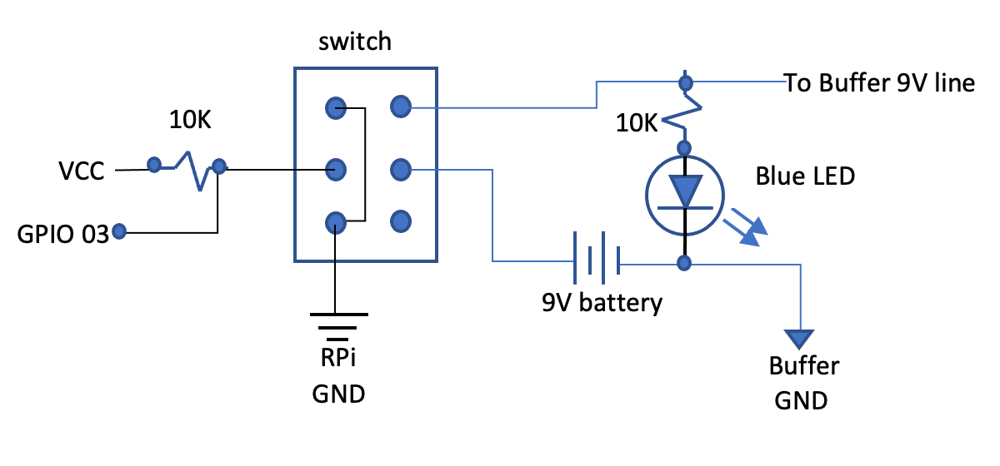
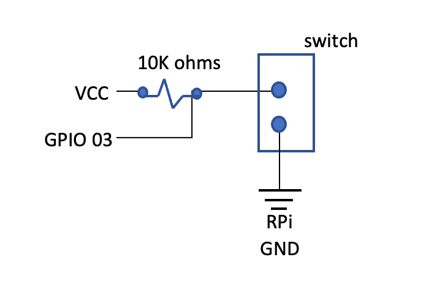
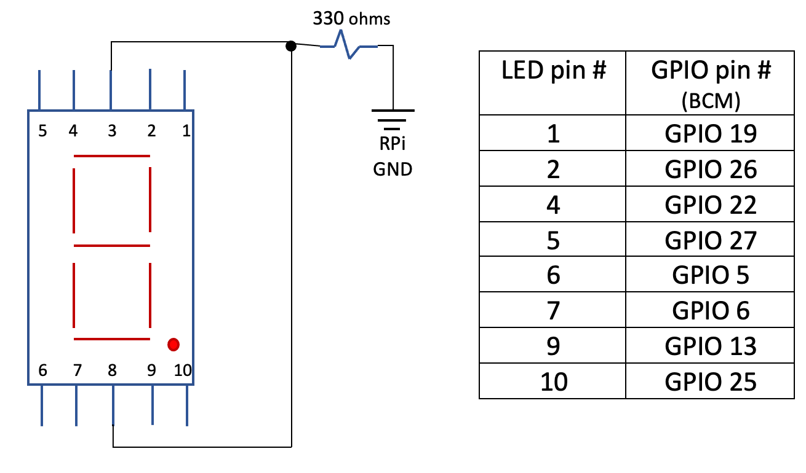
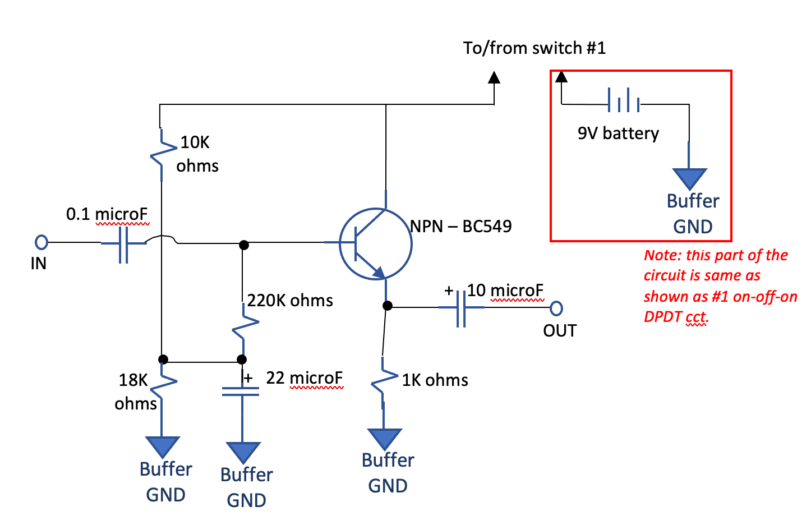

This page shows the circuits that need to be wired to the raspberry pi. You will need a small breadboard to solder everything. I suggest a board that mounts as a "hat" to the RPi so you don't need to buy pin wires.

If you have not done so - read the [Basic Concepts](/Looper/Basic-Concepts-Introduction/) which explains how the Raspberry Pi and the optional buffer electronics is used.

#### Raspberry Pi GPIO

The raspberry pi comes with a 2 x 20 pin strip called the GPIOs - which stands for General Purpose Input Outputs.  Some of these are pretty sophisticated - but we will only use them in their most simple application: to read the status of switches and to drive light emitting diodes (LED).  The GPIO is how we command the Looper program loaded unto the raspberry pi.

You will need to conect some of the pins to either the switches terminals, to resistors or to LED using a small breadboard to solder everything. I suggest a board that mounts as a "hat" to the RPi so you don't need to buy pin wires. check out the [parts list](/Looper/Electronics-parts-list/) for details.

##### GPIO naming:

There are different way to name the pins.  The simplest called "Physical Pins numbers" is to count the pins from 1 to 40 on the board connector strip.  This is not  the one used typically with software module in Python.  

Instead - I use the  Broadcom chip-specific pin or "BCM" naming. This is the column "NAME" in the image below.  For example, if the circuit diagram shows that you need to connect to pin GPIO20 - that means that you need to connect a wire the physical pin number #38 on the raspberry pi connector.

 
 
Source: <a target="_blank" href=https://learn.sparkfun.com/tutorials/raspberry-gpio/gpio-pinout>Raspberry Pi GPIO details</a>

#### Switches circuits

The looper has two switches:
- Play/Rec/Stop: is a push-on normally-off  "foot stomp" switch common to all options.
- Mode Control is either:
    - a DPDT On-Off-On toggle switch is buffer is used, or
    - a SPST On-Off toggle switch is the buffer is not built as part of the looper

##### Play/Rec/Stop switch:
Make sure you get a Push-On, normally-Off guitar pedal type stomp switch - and NOT the click-toggle type.  Push means when pressed, on state is held until let go.  You need to be able to hold the push stomp switch down for a few seconds to access some functions - and a click-toggle switch cannot do this.

##### Mode switch - with Buffer option built into Looper
Use a On-Off-ON DPDT toggle switch. You also need:
- a 9V battery and a 9V connector with lead wires
- a blue LED (acts as indicator that buffer circuit is On - and using the battery)

##### Mode Switch - If no Buffer is included in Looper
Use a simple On-Off Toggle switch 

#### LED circuits:
These circuits describe the circuits for:
- Play: green LED
- Rec: red LED
- Counter/track indicator: 7 segment common cathode LED

(*The blue LED is shown with the Mode switch with Buffer option - and not shown here.*)

##### Green and Red LED (Play/Rec)
- The Green LED circuit connects to GPIO16 (BCM Naming)
- The Red LED circuit connects to GPIO12 (BCM naming)

##### LED 7-Segment
Ensure you use a **"common cathode"** 7-segment LED

#### Optional Buffer circuit
If you have selected to include the buffer circuit, and the associated Mode Switch (on-off-on DPDT toggle), build the following circuit on the same breadboard as the rest of the switches and LED circuits - making sure that it is separated from the Raspberry pi power and ground (these should **NOT** be connected together on the breadboard).

- Buffer circuit connects to 9V battery – completely separated from RPi
- Buffer circuit Ground (GND) is NOT connected to RPi ground.
- Buffer circuit uses two mono ¼ inch guitar jacks (female) Input & Output – not connected internally to RPi circuit/RPi GND.  
    - Connect the connector  that contacts the tip of the jack to IN or OUT.  
    - Connect the connector that contacts the sleeve to the Buffer GND (not raspberry pi ground).

> There are various alternatives for the output jack using 3.5mm plugs that can be used here.  See the discussion in the [parts list](/Looper/Electronics-parts-list/) document.

