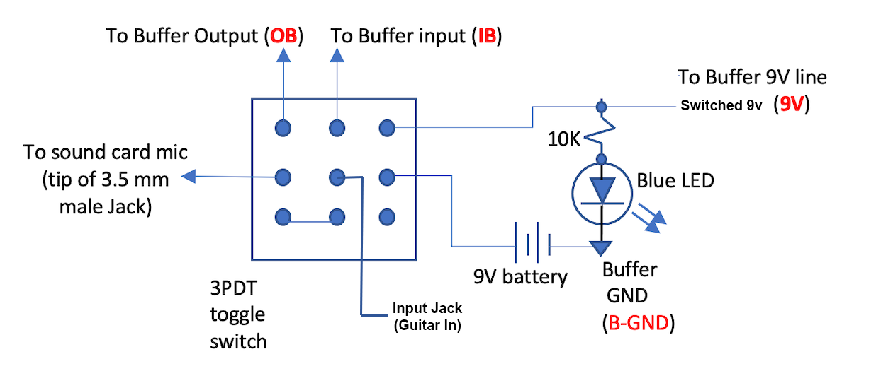

This page shows the circuits that need to be wired to the raspberry pi.  If you have not done so - read the [Basic Concepts](/Looper/How-to-Build-it-Introduction/#sectionTop) which explains how the Raspberry Pi and the optional buffer electronics are used.

Per [Parts List](/Looper/How-to-Build-it-parts-list/#sectionTop) you can [contact me](/contact#sectionTop) to get the Printed Circuit Board which corresponds to the schematic below.

If you are using the RPi HAT Proto board - due to physical constraints, the pin connections between Raspberry Pi GPIO connector and LED/switches are different.  A table on the schematic gives those value that should be used instead.

>If you plan to use RPi HAT Proto Board, and the assembly instructions I provide, you won't have to worry about the schematics as I have laid out every part and its connection.  However, if you want to learn the details of the circuit - you will need to decide which implementation you use.

#### Schematics for Looper Pedal (with buffer) Option:

For those who already know how to read a schematic and don't need all the details that follows - here it is:

> If you don't know how much about electronics symbols, and the Raspberry Pi GPIO connector - read on - I go through everything one-by-one in details.
> If you don't want to learn the electronics just yet - and want to simply assemble the circuit to get going with the Looper, go to [Parts List](/Looper/How-to-Build-it-parts-list/#sectionTop) first, to find out what parts to get, then go to [Assembly Instructions](/Looper/How-to-Build-it-assembly-circuits/#sectionTop) to start soldering stuff.

#### Raspberry Pi GPIO

The raspberry pi comes with a 2 x 20 pin strip called the GPIOs - which stands for General Purpose Input Outputs.  The GPIO is how we control the Looper program loaded unto the raspberry pi.

> GPIO pins are what make the Raspberry Pi different and so much more useful than your home computer.  You are basically given pins connect things to (like a switch) so your (programming) code detect when the switch is turned on or off - and do stuff based on that. Or you can connect things like light emitting diodes (LED) to them, and your code can turn them on or off as you want.  If you wanted to do this on your laptop you would need to build some electronics outside of it, and probably write code to talk to this electronics via USB for example.
Note that some of the GPIO pins are very sophisticated to transmit data serially for example, - but the Looper only use them in their most simple application: to read the status of switches and to drive light emitting diodes (LED).  

##### GPIO naming of the pins:

There are different way to name the pins.  The simplest called "Physical Pins numbers" is to count the pins from 1 to 40 on the board connector strip.  This works - but it is not the naming convention used in most software written for the Raspberry Pi - so to keep things coherent with other code out there, I used the "other" naming convention - called BCM .  

The Broadcom chip-specific pin "BCM" naming correspond to the column  "NAME" in the image below.  For example, if the circuit diagram shows that you need to connect to pin BCM20, look for GPIO20 in the Name column, and you will see that  you need to connect a wire the physical pin number #38 on the Raspberry Pi connector.
> Are you frustrated that the schematic uses "BCM20" and the diagram below uses "GPIO20"?  Well, I was too when i got started with this.  I found both on the internet resources available - often used interchangeably.  Personally, I think that naming the pin BCM20 is better, because it makes it 100% clear that we are using BCM naming and not physical pin count.  But you will often find things called GPIO20 - and there will be a note somewhere that the document is using BCM naming...

 
 
Source: <a target="_blank" href=https://learn.sparkfun.com/tutorials/raspberry-gpio/gpio-pinout>Raspberry Pi GPIO details</a>

 #### Schematic Symbols definition

 The image below defines each symbol used in the schematics on this page: 

 

#### Switches circuits

The looper needs two switches:
- Play/Rec/Stop: a push-on normally-off  SPST momentary foot stomp switch. (SPST: Single Pole Single Throw)
- Run/Edit Mode switch: a DPDT (Double Pole Double Throw) latching foot stomp switch. Edit mode is also True Bypass mode.

The buffer needs one additional switch:
- Buffer ON Switch: a 3PDT latching foot stomp switch.

 
 > Some definitions:  
 > ***Latching*** means that once pressed the switch stays in that "position" until pressed again - when it goes to the other position.  
 > ***Momentary*** means that the switch makes contact (ON) only has long as it is pressed - and goes back to OFF when released.  
 > ***Single Throw*** means that there are two pins.  When switch is ON, pin 1 connects to pin 2. When OFF, Pin 1 is not connected to anything.  
 > ***Double throw*** means that there are three pins. The switch connects the middle pin to the bottom pin, when it is in one position, and then connects to the top pin when it is in the other position. There is not really a concept of ON or OFF here - more a concept of connect to one side or the other.  
 >***Double Pole*** means there are two sets (columns) of pins. When the switch is thrown both sets are actuated together: think of having two single poles switches taped together).   
 > So a ***DPDT*** switch has 3 pins in a column because it is double throw, and 2 columns because it is Double Pole, which makes six pins.  
 > A ***3PDT*** switch similarly has 3 columns of 3 pins each  = 9 pins.  
 > It is always a good idea before soldering to a multi pin switch like a 3PDT to use your ohmmeter and find out which way the pins connect so you can orient it correctly before soldering to it.  

##### Play/Rec/Stop switch:
Make sure you get a ***Momentary*** guitar pedal type stomp switch - and NOT the latching click-toggle type.  Push means when pressed, on state is held until let go.  You need to be able to hold the push stomp switch down for a few seconds to access some functions - and a click-toggle switch cannot do this.

How it works:
- When the switch is off, the corresponding GPIO pin is connected to ground via the 10K ohms resistor.  This means that the python code, when reading this GPIO pin will see 0 Volt - which corresponds to logic 0 (or low).
- When the switch is ON, The GPIO pin is connected directly to VCC - which is the 3.3Volt from the RPi GPIO (physical pin 1). In this case the python code when reading the GPIO pin sees a logic 1 or high.
> The resistor is placed there to limit the current flowing from 3.3V to Ground. the amount of current flowing is given by ohms law: V=RI, so I = Voltage / resistance = 3.3V / 10,000 ohm = 0.33 milliAmperes (the K indicates Kilo which means one thousand so 10K = 1000).  
> If there was no resistor - the resistance value = 0 so the current is 3.3Volt / 0 = infinity! - This is a short circuit that would burn up the Raspberry Pi GPIO - and probably the whole board since there are no breaker of fuses on the RPi board.

##### Mode switch : Run/Edit(bypass)

The mode switch Python code whether it is in mode Run (o volt = logic low) or in edit mode (logic high). It also acts as a True Bypass when it is set in Edit mode.

This uses a foot stomp Toggle switch: Latching On-ON DPDT. because it is latching, the switch stays in the last "stomp" position until is is pressed agin.  

How it works - Because it is double pole - there are effectively two switches acting together:
- Pole 1 is the column of pins on the right:
    - When the switch has connected the middle pin to the top pin (which is unused), the GPIO pin (BCM 3) is connected to VCC (3.3Volts) via the resistor (and since internally the GPIO pin is also connected to an internal "pullup" resistor to VCC) - the python code will see a logic high on this pin. This corresponds to the Edit(bypass) mode.
    - When the switch is toggled so that the middle pin is connected to the bottom pin - the GPIO pin is connected to Ground - and the python code sees a logic Low on this pin: this corresponds to the Run Mode.
- Pole 2 is the column on the left:
    - When the switch is connected to the top pin (which is mode Edit(bypass)) - The pedal input (guitar IN) signal is connected directly to the Looper Out Jack: we have true bypass: a wire connects guitar In to looper out - the guitar just plays through.
    - When the switch has connected the middle pin to the bottom pin (this is run mode), the output of the soundcard headphone signal is connected to the Looper Out jack:  this is the normal operation of the Looper. Whatever is being played inside the looper (Raspberry Pi Python code) - is heard at the output.  

##### Buffer-ON toggle switch 
Use this switch if including a buffer in the looper.

This uses a 3PDT (3-pole double throw) toggle switch - with a lever (not stomp).
- a 9V battery and a 9V connector with lead wires.
- a 10K resistor and blue LED (acts as indicator that buffer circuit is On - and using the battery).

How it works:

- Pole 1 is the column on the right and controls power to the buffer.  
    - When the switch is toggled to "buffer ON", the middle pin is connected to the top pin. The battery is connected to the buffer circuit (Switched 9V) which powers the buffer.  Also the 9V voltage flows through the resistor and the light emitting diode (LED) is lit.
    - When the switch has connected the middle pin to the bottom pin which is not connected to anything, the top pin has no power (buffer is off, LED is not lit) - and the battery is not connected to anything - thus it is not loosing charge.
- Pole 2 is the middle column:
    - The middle pin is connected to the input jack (guitar IN). When middle pin connects to the top - Buffer is ON, the guitar In signal is sent out to the input of the buffer (when then does it's "buffer thing" on it), and puts out the impedance corrected signal at buffer Output.
    - When the middle pin connects to the bottom pin, the buffer is off: The buffer input receives nothing. The Guitar In signal is hard wired to the bottom pin of pole 3 (see next).
- Pole 3 is the left column:
    - The middle pin of pole 3 goes to the mic input of the soundcard: this is the signal that the Looper records. When the middle pin is connected to the top pin, buffer is ON, and the buffer output signal is connected to the Looper mic input.  
    - When the middle pin is connected to the bottom pin - the buffer is OFF, and the bottom pin is hard wired to the bottom pin of Pole 2 - which is at the moment connected to Guitar In: Thus the guitar In signal is sent to Looper mic input (i.e. the buffer is no in the circuit). 
    
    So when the buffer switch is ON, the guitar In signal goes through the buffer before being fed to the Looper mic input.  
    When the buffer switch is OFF, the battery circuit is interrupted - so no current flows from the battery.  The guitar IN signal is fed directly to the Looper mic input.

#### LED circuits:
The Looper circuit uses:
- Play: green LED
- Rec: red LED
- Counter/track indicator: 7 segment common cathode LED

The buffer circuit uses the blue LED - which is shown with the Buffer On Switch circuit above.

##### Green and Red LED (Play/Rec)

The Red LED is lit by the Python code when the Looper is recording a track.
The Green LED is lit by the Python Code when the mode Switch is in Edit (Bypass) mode.
> Refer to schematics for GPIO pin connection

How it works:

- The Python Code has the ability to set GPIO pins as outputs.  This is done for the pin that connect to the resistor of each LED.
- The Python Code then has the ability to set the output of a pin to ***high*** - which is 3.3V, or to ***low*** which is RPi Ground (0V).  Setting the pin to high is like connecting a 3.3V battery to the pin.
- When the pin is low - at 0V, no current flows through the circuit, and the LED is Off.
- When the pin is high - current flows through the Resistor and the LED:
    - Without going into the physics of the LED, it is enough to understand that once an LED starts to conduct current, it will drop approximately 2V across its terminals. (RED: 1.7-2V, GREEN: 2.1-2.2V.
    - This means that we need a minimum of 2 volts, at the GPIO pin to turn on an LED:  we have 3.3V so - we are OK. So where is the rest of the voltage?  It is "dropped" across the resistor.
    - The voltage on one side of the resistor (GPIO pin) is 3.3V.  The Voltage on the other side of the resistor (entry to LED) is 2V.  So we are dropping 1.3V across the resistor - and using again Ohm's law current (I) = Voltage(V) / Resistance (R). With a resistor of 270 Ohm per our schematic, we see that 4.8 mA (milliAmperes) flows across our resistor.  
    - By increasing the resistance value we lower the current - which makes the LED dimmer.  Conversely, decreasing the resistance increases current making the LED brighter.  

    > I recommend you wire up a diode circuit to test if you like the brightness of the LED.  Also, even though the schematic uses the same resistor (270) for both LED - you can experiment and choose two different resistor to get the brightness you like for each diode.

##### LED 7-Segment
Ensure you use a **"common cathode"** 7-segment LED

How it works:

- each segment is a separate diode.  Current enters a given diode at the pin corresponding to the (letter) segment, and flows out pin 3 or 8 (does not matter since 3 and * are the common cathode and connected together internally).  
- The cathode is always the "exit"point of the current out of the LED (see symbol definition above).  This means that we must set the voltage at the control pins higher then the voltage at pin 3/8.  We do this by connecting the control pins to a GPIO pin, and the pin3/8 connect through ground (0v) through a current limiting resistor - similar to what was explained above for red/green LED.  
- It does not matter if the resistor is before or after the diode, but if we put it after - we only need one.
> Be advise that I am cheating here.  The recommended practice is to put one resistor on each pin and connect 3/8 directly to ground. This is recommended to make sure that each diode get the same current whether one or more segment are lit - to ensure equal brightness.  
> In our case, remember that the current is decided by the resistor - which here is 390 ohm. If we use a voltage drop of 1.7V for the red led segment we find current = (3.3 - 1.7) Volt / 390 ohms = 4.1 mA.  However if two segments on, they have to share this current among them - so if we had two exactly the same segment - they would each get about 2mA.  Then when all 8 segments are on, they get about 0.5 mAmp each - which is dim.
> However, LED are not linear like resistors, so when they are turning on - which is the region we are operating in - a small increase of current does not necessarily means a bit change in brightness.  You should test it - but for our application the change in brightness between displaying number 1 vs number 8 is not that noticeable - or foes not affect the purpose for which it is use (counting down position in a track).   
> If you ever build a project where you have multiple 7-segment displays next to each other, then you should not use only one resistors - because a #1 next to a #8 will be different enough to look bad. (But here we only have one - so it does not really matter).

#### Optional Buffer circuit
If you have selected to include the buffer circuit, and the associated Mode Switch (on-off-on DPDT toggle), build the following circuit on the same breadboard as the rest of the switches and LED circuits - making sure that it is separated from the Raspberry pi power and ground (these should **NOT** be connected together on the breadboard).

- Buffer circuit connects to Switched 9V  (power from battery through Buffer On switch) – completely separated from RPi.
- Buffer circuit Ground (GND) is the negative of the battery NOT connected to RPi ground (GNDREF on schematic).

> There are various alternatives for the output jack using 3.5mm plugs that can be used here.  See the discussion in the [parts list](/Looper/How-to-Build-it-parts-list/#sectionTop) document.

A discussion of how it works is too long for this page. I will eventually post something separately.

> The 470K ohm resistor plays a key role to increase the input impedance of the buffer - which we want has high as possible ro match the output impedance of the guitar (It has to be high enough to not reflect too much power, but low enough to provide enough current to the transistor).  
> The higher the resistance, the better the power transfer and the purest the tone (of your guitar).  
> However, if your guitar puts out two much voltage (hot pickups, or you play really hard with a puck) - the higher resistance means more power transferred, and you may overdrive the transistor - creating distortion.  In this case you may want to lower the resistor. Listen for the tone you get to decide what is good for you.  
> If you like the distortion sound (very vintage with one transistor) - you can keep the resistor but turn down the volume for clean parts.  

As always I recommend building the circuit on a bread board and trying it out to see what you get before soldering everything.  But the values that are there should work - if you just want to go ahead.

