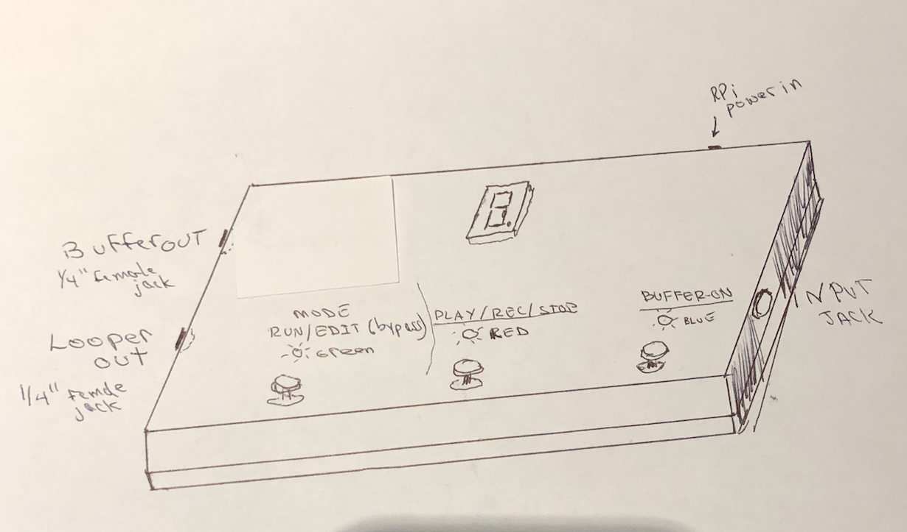
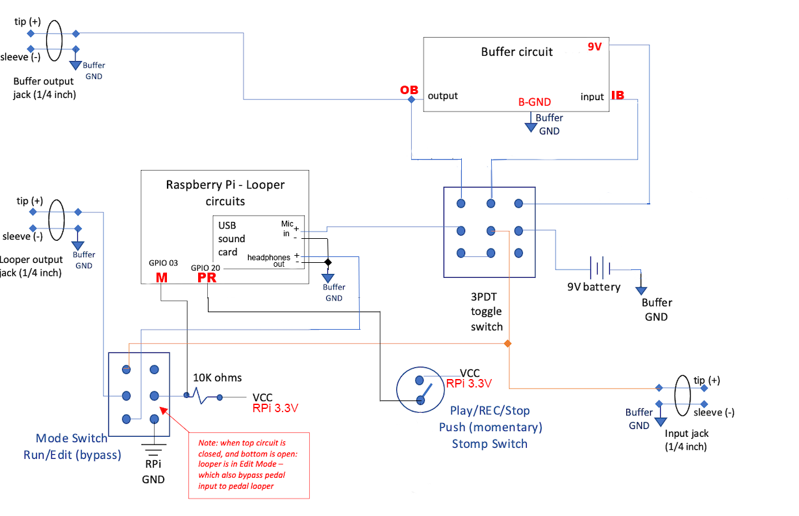
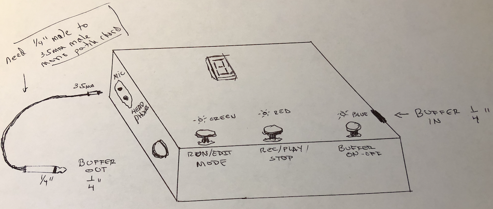

The Looper can be build in three different options:

1. Looper+Buffer: Integrated input/output.
2. Looper+Buffer: separate design
3. Looper only (no Buffer)

### The Buffer - Why?

As explained in the  [Introduction](/Looper/How-to-Build-it-Introduction/), it is necessary to condition the guitar/base signal before feeding it to the sound card of the Rpi - otherwise the tone of the instrument on input is affected negatively.  

If you always plan to use a separate buffer or pedal in front of the looper - you can use the simpler third option : Looper only (no Buffer).

But if you want to use the pedal with the instrument directly plugged in to the Looper - you will need one of the buffer options.  (Great for practicing).

#### Looper+Buffer: Integrated input/output

The buffer circuit is  completely separate from the Looper - except that it is assembled on the same breadboard (see [parts list](/Looper/How-to-Build-it-parts-list/)).
It uses a separate 9V battery and does not share the Looper power supply.

 In this option, The usb sound card is internal to the looper. Its mic and headphone female jacks are not accessible from outside the looper. 
 
The Buffer-ON 3PDT switch turns on the buffer (applies battery voltage), sends the guitar input to the buffer and connects the output of the buffer to the mic input of the Raspberry Pi internally (Looper input).  When this switch is off - the guitar input is connected directly to the mic input of the sound card (and the buffer/battery are off)

The Buffer output is made available outside of the Looper pedal to a 1/4inch female jack.  
> If the Raspberry Pi (Looper) is off or not powered at all, this allows the pedal to be used as a buffer. It could be used as a DI box to feed into an iphone or a computer to interface with various music programs such as Garage Band.

The mode switch acts as a true bypass switch.  When the looper is in run mode, the output of the RPi Looper is sent to the pedal looper output jack (1.4 inch - female).  When the looper is placed in edit (bypass) mode, the guitar input is connected directly to the Looper output: this is true bypass (only wires).  This is useful if the Looper is part of a pedal chain.

>Note: This version does not include a separate headphone jack.  An adapter 3.5mm to 1/4" can be use to connect a headphone into the output. (A separate headphone jack could easily be added in parallel to the 1/4" guitar output jack).  

##### Connections of Switches:

#### Looper+Buffer: Separate design

This option keeps the buffer and Looper Input and Outputs separate.  In this case, the Buffer-ON switch is a simple on-off (SPST) switch.

- Buffer:
    - The buffer section has a 1/4" mono input and output female jacks.  
    - The Buffer-ON switch feeds the guitar input to the buffer. When this switch is off, nothing goes to the buffer output jack (1/4" mono).
- Looper (without using the buffer):
    - the sound card 3.5 mm female mic input and headphone output are opened to the side of the case.
    - Instrument, microphones etc. are connected to the soundcard mic input. You need to provide the correct cable adapters (for a 3.5 mm mono male jack to plug into the mic port). Instruments should go through a DI box, a buffered pedal, or perhaps a multi-effects processor.
    - Headphones can be connected directly to the headphone output of the sound card, or a 1/4 inch male adapter can be use to connect to an amplifier.

> To use the buffer as a DI box to condition your guitar signal:  Plug the guitar in the buffer 1/4 inch input jack, turn on the buffer (Buffer-ON switch), and connect a small (6 inches) adapter cable 1/4 inch male plug to 3.5 mm male plug (mono)  to connect the Buffer output jack to the sound card mic input jack.

> There is no true bypass in this case for the looper.

#### Looper Only (no Buffer)

This option uses only the sound card mic/headphone jacks.  The output toggle switch and the input buffer switch are not used.

There is no 1/4 inch jacks for the guitar. The instrument should be put through a buffer, a pedal or a DI box and then fed to the sound card mic input via a 3.5mm male mono plug.

The output is via headphone (like the separated option).

This option should not be used if the intention is to plug the guitar directly into the Looper.
