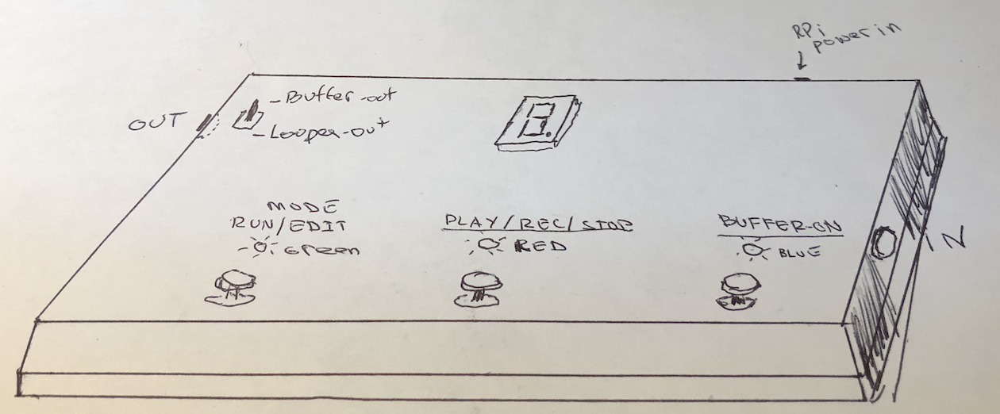

The Looper can be build in three different options:

1. Looper+Buffer: Integrated input/ouput.
2. Looper+Buffer: separate design
3. Looper only (no Buffer)

### The Buffer - Why?

As explained in the  [Introduction](/Looper/How-to-Build-it-Introduction/), it is necessary to condition the guitar/base signal before feeding it to the sound card of the Rpi - otherwise the tone of the instrument on input is affected negatively.  

If you always plan to use a separate buffer or pedal in front of the looper - you can use the simpler third option : Looper only (no Buffer).

But if you want to use the pedal with the instrument directly plugged in to the Looper - you will need one of the buffer options.  (Great for practicing).

#### Looper+Buffer: Integrated input/output

The buffer circuit is  completely separate from the Looper - except that it is assembled on the same breadboard (see [parts list](/Looper/How-to-Build-it-parts-list/)).
It uses a separate 9V battery and does not share the Looper power supply.

 In this option, the Looper+buffer pedal share the same input and output.  However, it is possible to use the buffer separately (with the Looper turned off - not powered) - inside a pedal chain. 

The "Buffer-On" foot stomp switch is provided to direct the guitar IN signal to the buffer - feeding the buffer output internally to the Looper mic input.  If this switch is off, the guitar input signal is fed directly to the looper (choose this if inside a pedal chain).

Similarly, an output toggle switch is provided to select whether the output jack is fed the output of the Looper or only the output of the buffer.  

> If the Raspbery Pi (Looper) is off or not powered at all, this allows the pedal to be used as a buffer. It could be used as a DI box to feed an iphone or a computer to interface with various music programs such as Garage Band.

>Note: This version does not include a separate headphone jack.  An adpater 3.5mm to 1/4" can be use to connect a headphone into the output. (A separate headphone jack could easily be added in parrallel to the 1/4" guitar output jack).  

#### Looper+Buffer: Separate design

This option keeps the buffer and Looper Input and Outputs separate.  In this case, the output toggle switch (from the above option) is not used.

- Buffer:
    - The buffer section has a 1/4" mono input and output female jacks.  
    - The Buffer ON switch feeds the guitar input to the buffer and buffer output to output jack. When this switch is off, the input jack is passed straight out to output jack (1/4" mono).
- Looper:
    - the sound card 3.5 mm female mic input and headphone output are exposed to the side of the case.
    - Instrument, microphones etc. are connected to the soundcard mic input. You need to provide the correct cable adapters (for a 3.5 mm mono male jack to plug into the mic port).
    - Headphones can be connected directly to the headphone output of the sound card, or a 1/4 inch male adapter can be use to connect to an amplifier.

> With this design, if the buffer is required (plugging guitar directly into the looper pedal), a small (6 inches) cable 1/4 inch male plug to 3.5 mm male plug (mono) must be used to connect the Buffer output jack to the sound card mic input jack.

> Also, with the Buffer switch set to off, a 1/4 inch guitar patch cord can be connected to the 1/4" input jack, and the 1/4 inch output jack is connected to the sound card mic input via the 6 inch adapter canle - allowing for a standard pedal to feed the looper.

#### Looper Only (no Buffer)

This option uses only the sound card mic/headphone jacks.  The output toggle switch and the input buffer switch are not used.

There is no 1/4 inch jacks for the guitar. The instrument should be put through a buffer, a pedal or a DI box and then fed to the sound card mic input via a 3.5mm male mono plug.

The output is via headphone (like the separated option).

This option should not be used if the intention is to plug the guitar directly into the Looper.
