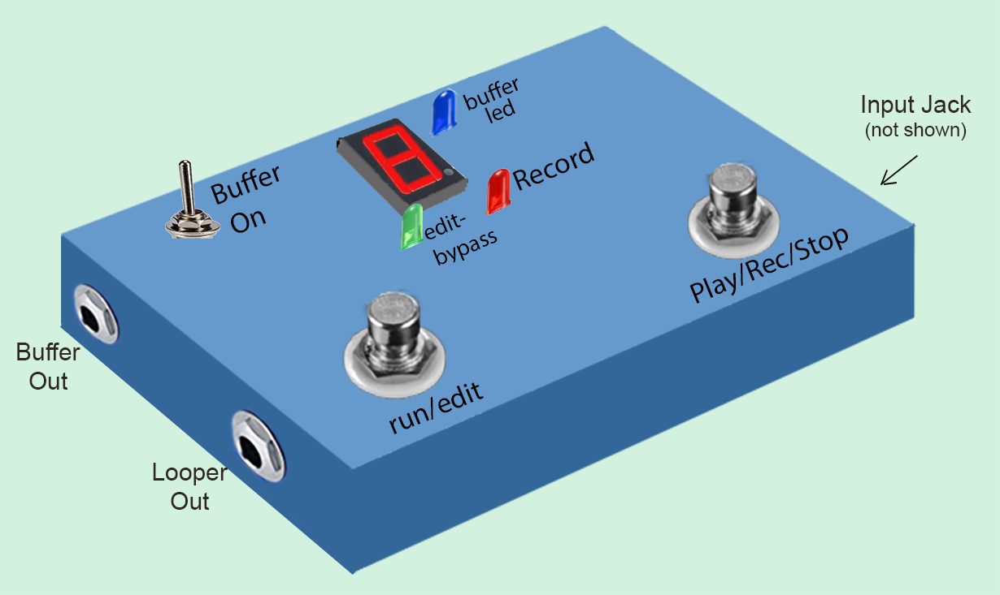
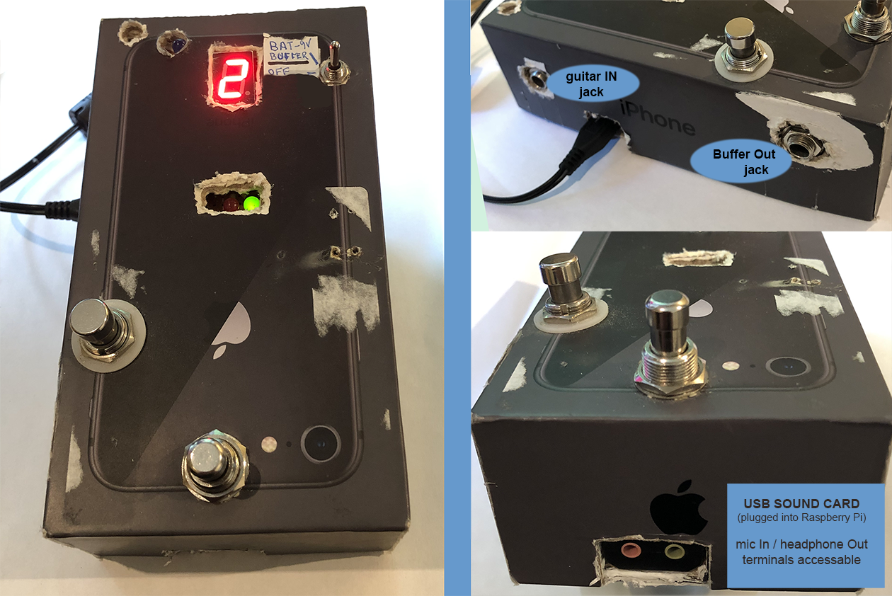

The Looper can be build in three different options

1. Looper Pedal Option: Looper+Buffer with Integrated input/output. - This is the looper pedal fully documented here.
2. Looper+Buffer Separate Option: A separate buffer in/out that you can plug in Looper sound card - all in the same box
3. Looper Only Option: no Buffer circuitry - only what is needed for the Looper

### The Buffer - Why?

As explained in the  [Introduction](/Looper/How-to-Build-it-Introduction/), it is necessary to modify the impedance of the guitar/base signal before feeding it to the sound card of the Raspberry Pi - otherwise the tone of the instrument on input is affected negatively.  

If you always plan to use a separate buffer or pedal in front of the looper - you can use the simpler third option : Looper only (no Buffer).

But if you want to use the pedal with the instrument directly plugged in to the Looper - you will need one of the buffer options.  (Great for practicing).

#### Looper Pedal Option: Looper+Buffer with Integrated input/output

This is the option that is fully documented here - and for which I will make a case design (3-D printing) available when ready.

The buffer circuitry is assembled on the same breadboard as the Looper electronics.(see [parts list](/Looper/How-to-Build-it-parts-list/)).  It uses a separate 9V battery and does not share the Looper power supply.

There are 3 guitar jacks (1/4 inch - female):
- Input (for instrument like guitar/base or synth)
- Looper Out
- Buffer out

There are three control switches:
- Buffer On/Off - toggle switch
- Play/Rec/Stop foot switch
- Mode Switch (Run/Edit(bypass))

How it works: (see [user guide](/Looper/How-to-Use-User-Guide/) for details)

- ***Buffer switch is ON***: The Blue LED is lit and the ***Instrument Input*** signal is sent to the buffer circuit. The Buffer output signal is internally sent to the Looper sound card input (which is plugged into the Raspberry Pi). 
- ***Buffer switch is OFF***: The ***Instrument Input*** signal is fed directly to the internal Looper sound card (for times when you don't need to use the buffer). 
- ***Mode switch is in Run mode***: The (internal) Looper sound card output (headphone out) is fed to the ***Looper Out*** jack  - Basically, the Looper is working normally, and the Play/rec/Stop switch controls the function of the Looper.  
- ***Mode switch is Edit(bypass) mode***: the Instrument (guitar) Input signal is connected directly to the ***Looper Out*** jack: This is ***True Bypass***.  Even if the buffer is on, the ***edit/bypass mode*** always passes the raw Instrument (guitar input signal to the Looper Out jack.
- The ***Buffer Out jack*** always outputs the buffered sound of the guitar.  If the Buffer switch is off (blue Led is off) - no sound appears at the Buffer Out jack. Note that the Raspberry Pi does not need to be powered at all for Buffer Out to work - since it uses the internal 9 volt battery.

>In this option, The usb sound card is internal to the looper. Its mic and headphone jacks are not accessible from outside the looper. 
 
This version does not include a separate headphone jack.  An  3.5mm to 1/4 inch adapter can be use to connect a headphone into the Looper output jack. (Design mod: A separate headphone jack could easily be added in parallel to the 1/4" guitar output jack).  

#### Looper and Buffer - Separate Option:

I have not fully documented this option here - and will not be offering a 3-d printable case design.  This is however, the first version I built as a prototype.  You can use the same circuits and printed circuit board as the Looper pedal option (above).  You will use different (less complex/cheaper) switches and one less jack.

Basically - you are using the same circuit as above, but you are keeping the Looper input/output and the buffer completely separate.  It is like if you built a separate buffer pedal - but you are keeping everything in the same box. Here's my version mounted inside an old iphone box:

This option keeps the buffer and Looper Input and Outputs separate. The sound card mic input and headphone output are exposed:

- In all use cases, the headphone out (green terminal) of the sound card must be connected to an amp/speakers or headphone.  the connection uses a 3.5mm male jack (mono or stereo will work - if stereo plug is used, sound will be on left channel only).
- To use the looper with the buffer, turn the buffer ON with the buffer toggle switch, plug the guitar in the guitar IN jack, and connect the buffer OUT jack to the soundcard mic input (pink terminal) - with a short patch cord. Note: the Guitar IN jack ***only*** goes to the buffer.
- To use the looper without the buffer, plug the guitar into something that will buffer it - and plug the output of that device into the sound card mic input (pink terminal).  (See [Introduction](/Looper/How-to-Build-it-Introduction/) for list of devices that buffer a guitar).
- Patch Cable:  Since most guitars use a 1/4 inch mono patch cord, and since the buffer Out is also a 1/4 inch jack, in both cases (buffer or direct guitar) -  you will need to buy a 1/4 inch to  3.5 mm mono adapter like this [one on Amazon](https://www.amazon.ca/CGTime-Golden-Plated-Converter-Adapter/dp/B01M6CQYUK/). Or you can construct a specific cable (which is what I did).  
>Be careful - if you use the sound card listed in the [Parts list](/Looper/How-to-Build-it-parts-list/)- your adapter or patch cable ***must be mono*** male 3.5mm plug - it will not work with stereo plug.

The switches have the same basic function as the Looper pedal option described above, except that the Mode Switch (run/edit) is no longer a True Bypass - since you need to physically connect either the guitar or the buffer out to the sound card mic input.

>There is no True Bypass with this version of the looper.

> Similarly to the Looper pedal option above - you can use the buffer as a D.I.box for a sound card in any computer without having to power the Raspberry Pi - the buffer uses a 9V battery.

#### Looper Only Option (no Buffer):

This option uses only the sound card mic/headphone jacks.  

The design is similar to the iphone box prototype shown above except:
- There is no guitar IN and Buffer Out Jack
- You don't need the Blue LED
- You don't need the Buffer On toggle switch
- You don't need the buffer circuit.

Your guitar should be connected to something that buffers the signal as explained in the [Introduction](/Looper/How-to-Build-it-Introduction/). The output of this "something" connects to the sound card mic input (pink terminal) - using a 3.5 mm mono plug.

If you connect the guitar directly in the sound card - it will still work but the sound will be poor (loss of tone - "thinny sound").

There is no 1/4 inch jacks for the guitar. The instrument should be put through a buffer, a pedal or a DI box and then fed to the sound card mic input via a 3.5mm male mono plug.

The output is via headphone terminal of the soundcard  (like the separated option).

This option should not be used if the intention is to plug the guitar directly into the Looper.
