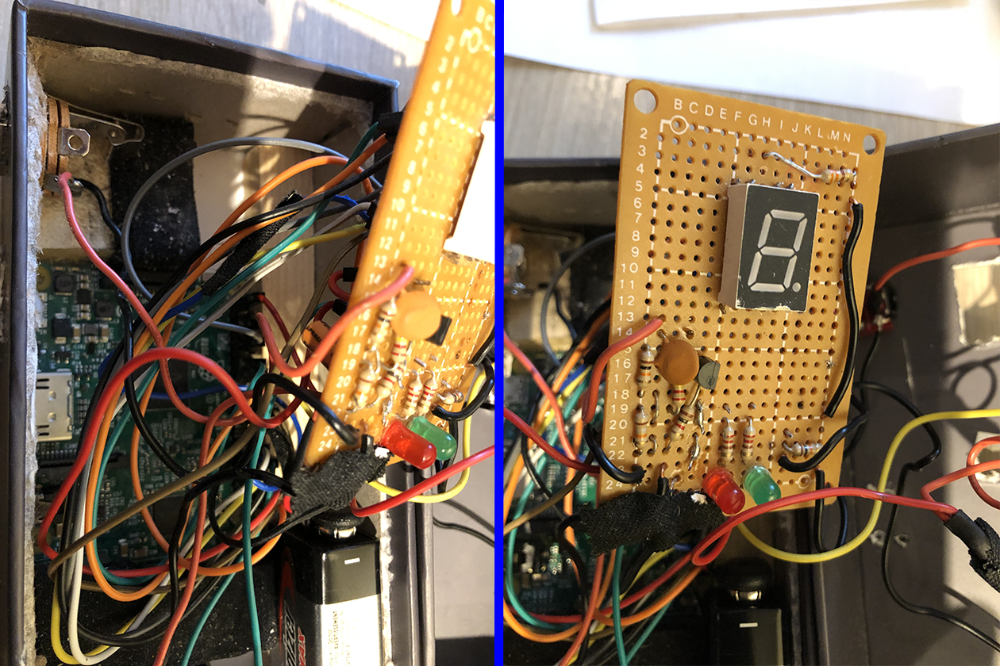
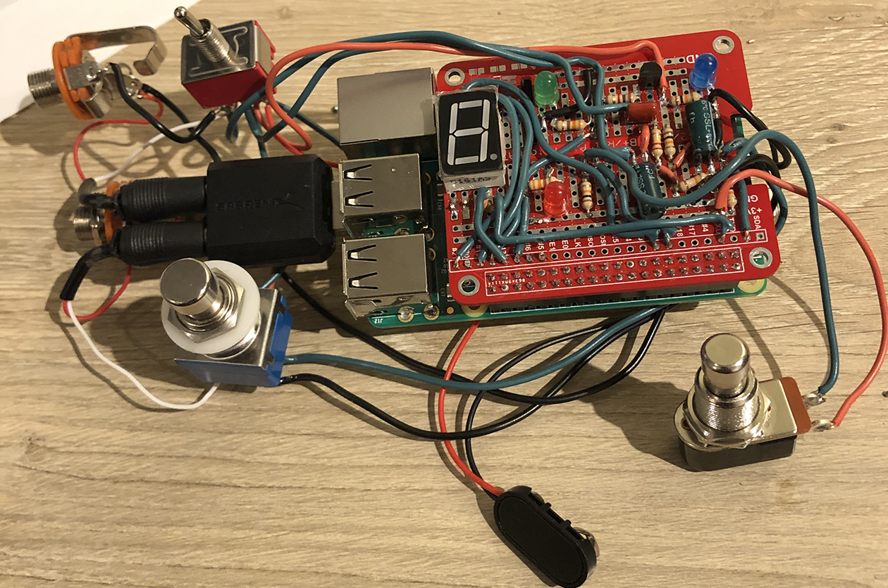
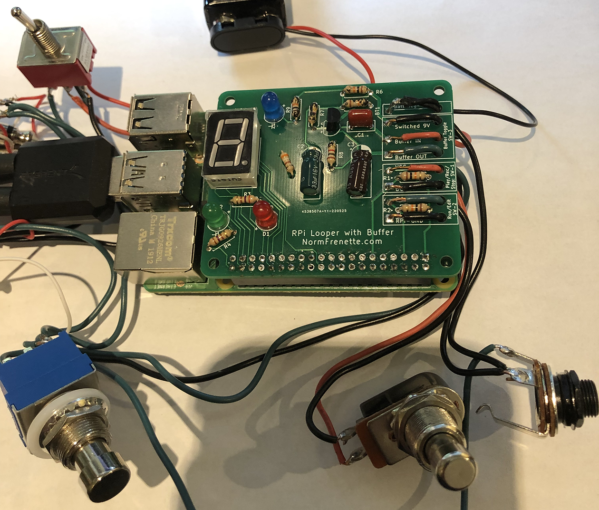
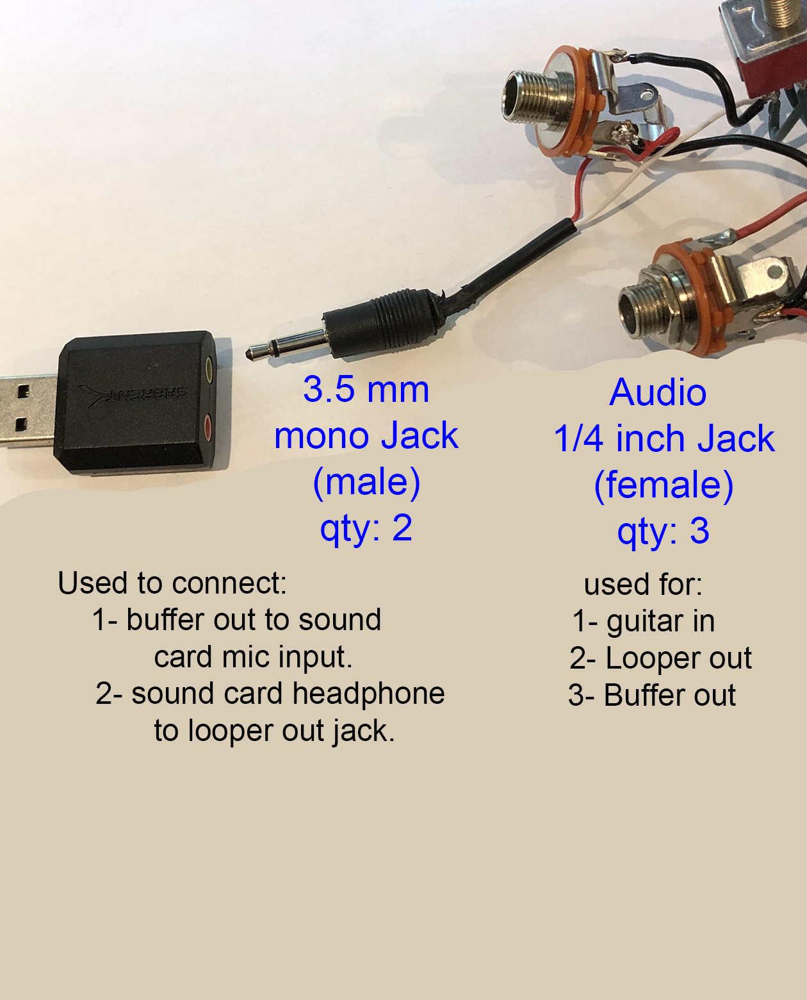
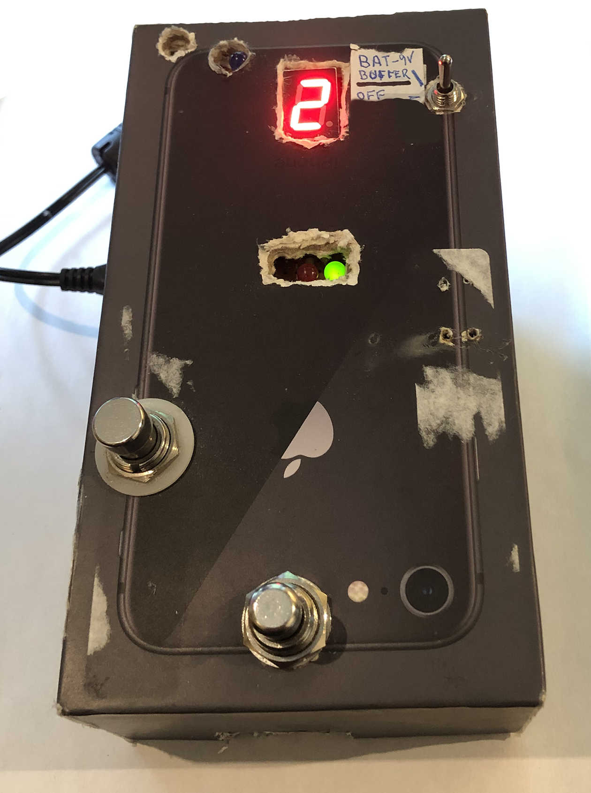

This document the various parts required to build the Raspberry Pi Looper.  

#### Raspberry Pi

I recommend the raspberry pi (RPi) version 3B+ or 4.  The RPi must have wifi and bluetooth (if you want to use the ios app - which is recommended).

Can you use a pi zero W?  Simply put - I am not sure.  If you have one lying around - please try it and let me know how it works. Leave a comment below so others can share your experience. 
>The original pi zeroW had only one core.  The python program is written to use multi-cores as much as possible but the code will run on one core - meaning it will not crash.  The problem is that the audio sampling and playback could be affected by file operations (like saving to SSD card) - and may create stuttering in playback.  At some point I intend to test this - and when I do I will update this.

What about the pi zero 2 W? I have not obtained one yet - but I think it should work just fine as it has 4 cores.  So go for it!

#### Power Supply for Raspberry pi:

I strongly recommend that you purchase a dedicated 5V 2.5 amp power supply that fits your raspberry pi.  Make sure it matches the connector on your selected RPi: the RPI 3B+ uses micro-usb plug whereas the RPi4 uses a usb-c connector.

I got the power supply for my RPI 3B+ at [Canakit](https://www.canakit.com/raspberry-pi-adapter-power-supply-2-5a.html).

For my RPI4 - I used a 4 port usb power supply with a usb-a to usb-c cable that I had lying around to charge my motorcycle helmet communicators.  It works fine.  I bet an ipad or tablet charger would work fine as well - just make sure you can put out 2.5 Amps for a RPI 3b+ or 3 Amps for a RPi 4 (as recommended on their website).

#### USB Sound Card:

Since we are trying to keep costs down - I recommend the following: Sabrent Audio Stereo Sound Adapter. It is less then $10 on Amazon and works fine.

Is it OK to use the RPi headphones?  I'll be honest, I did not have success with that option.  The output was noisy (buzzy) - and not good quality.

However, if you do not intend to plug in an instrument in the looper - you do not need a mic input like the sound card above.  You could go with just a sound card that has a headphone and/or speaker output - even maybe something from the Hi-Fi Berry line.  But in this case you will need a microphone that plugs into one of the usb ports.

#### Electronics

##### PCB / Proto Board

You need to decide what substrate you will use to assemble the electronics.  
From hardest (left) to easiest (right).

###### Single sided Pad Board:

Many a DIY guitar pedal was built on these.  I like the single sided because it allows to make connections with the bare wire of resistors, capacitors on the side that has no solder.  This solution however must use Raspberry Pi connecting wires like these - to connect the GPIO pins from the RPi 40-pin connector to the pad board.  

The result works fine - but there's a lot of wires to contend with when fitting it in a box...  I would recommend the pad board if you are only building the Looper WITHOUT the Buffer option.

###### RPi Proto Hat

These are very useful because they come with a solderable 40 pin connector (so you don't need the wires above).  They also breakout the GPIO pins, 3.3V and GND for easy connections, and provide a prototyping area with 5-hole strips for interconnects.  

I got mine at [Amazon](https://www.amazon.ca/gp/product/B07MCX54ZD/), but you can get them in many places, just search for "Breadboard PCB Shield Board Kit for Raspberry Pi".  The key is that it comes with a connector that fits the RPi pins, and labels that match the BCM naming.

It does get a bit difficult to route and solder all the wires from the 7-segment LED to the GPIO pins, but I did complicate my life by using 16-gauge wire I had left over - instead of getting 18 or 20 gauge which would have worked just as well...

The only problem I have with these is they do not provide a ground plane - which help with audio noise.  But I found it works fine (as long as you're not trying to play "Live at the Olympia").

The finished result is cleaner and easier to assemble - shown here mounted to the Raspberry Pi (which is underneath). - Ignore the surrounding switches for now.

###### Looper+ Buffer PCB:

I designed a PCB and had it manufactured in small quantities.  This is the easiest for assembly since all you need to do is drop the components in and solder.  There is also some stress relief provided on the edge of the board to connect the wires going to control switches.  

The biggest advantage is that I was able to clearly separate the buffer circuit from the RPi circuits - and provide two separate ground planes: This has improved audio noise reduction - which is now on par with my other guitar pedals.  

I plan to set up a facebook page or something similar for those who would like to get this PCB from me (for a small fee).  In the meantime - leave a comment below if you are interested and we'll connect somehow.

Here's the assembled view - mounted on the RPI:

##### Light Emitting Diodes(LED)

##### Standard LED:

You will need one red LED and one green LED.
Additionally - for the buffer option:  buy an extra blue LED.

>note: the short leg of the diode, which is connected to the larger piece of metal (you can see inside the plastic) is the negative lead: connect it to GND (ground) in the [schematics](/Looper/How-to-Build-it-circuit-schematics/#sectionTop)

##### 7-segment LED

You need one  *common cathode* 7-segment LED. *(You only need one - even though I show 2 here for display)*

> The common cathode is important! It means the center pins are grounded.  If you get the other type  you would have to change the circuit schematics and the python code to turn on the segments.  I strongly recommend to get the common cathode - unless of course you have no problem modifying the schematics and the code.

##### Resistors

- Column Looper indicates the quantities required for the Looper part of the circuit - use this if building Looper Only Option.
- Column Buffer indicates the quantities required for the buffer circuit.
- column Total shows the quantities required for Looper and buffer together: use this column if building the Looper Pedal option and the Looper+Buffer Separate Option.

| Value | Looper Qty | Buffer Qty | total |
|:----:|:----:|:----:|:----:|
|270|2| x | 2 |
|330|1| x | 1 |
|1K |x| 1 | 1 |
|10K|2| 2 | 4 |
|18K|x| 1 | 1 |
|470K|x| 1 | 1 |

> The 270 ohms resistor are used for the red and  green LEDs. They basically control the brightness. You can use 330 ohms or even 390 ohms if you want them less bright.  

> Similarly the 330 ohms resistor controls the brightness of the 7-segment LED display.  In my latest implementation, I have used a 390 ohm instead - because I like the display which shows the track count to be a little less bright.  If you play in a very sunny room - you might want to stick with the 330.

##### Capacitors

Capacitors are only needed for the Looper + Buffer option
 
| Value/Type | Looper Qty | Buffer Qty | total |
|:----:|:----:|:----:|:----:|
|10 microFarad electrolytic|x| 1 | 1 |
|22 microFarad electrolytic|x| 1 | 1 |
|0.1 microFarad (100 nanoF) |x| 1 | 1 |

0.1: use ceramic or tantalum or orange drop etc. (not electrolytic)

> The actual value 22 microFarad is not very important and does not affect the tonal response very much.  I have successfully used 33 microFarad (because I ran out of 22) - and the circuit works just fine.  

##### Transistor

The transistor is only needed if you are building the buffer.

The buffer circuit requires one **NPN BC549 transistor**. If you don't already have transistors - buy that one.  

Alternate transistor choice:  the BC550 is more or less a direct replacement.  

I use this transistor because it is a low noise transistor - which is useful in audio circuits.  If you don't already have transistor lying around - I suggest you get this one.

There are many vintage circuit that use the 2n2222 or even 2n3904 as well. I have not tested these - but if you have one of those instead, try them to see how they sound.  The circuit is the same. 

>WARNING: The BCxxx transistor series uses Collector (pin 1), Base (pin 2), Emitter (pin 3), whereas the 2N series uses the reverse (1-2-3: E-B-C).  Make sure you download the datasheet of the transistor you select to identify the pinout correctly.

##### Switches:

Get these three switches for the Looper Pedal (with Buffer) Option:

###### Play/Rec/Stop Momentary foot stomp switch

The switch used to control the Play, Record and Stop of the Looper is a momentary push button foot-pedal stomp switch.  It is important that you purchase a Push-type switch (it does not click) , which means that it is On while the button is pressed, and remains on as long as the button is pressed.

Search for ***Momentary*** Stomp Foot Switch like this one found at [Amazon](https://www.amazon.ca/gp/product/B077P1BFX9/)

Do not get the  click-on click-off toggle stomp switch found on many guitar pedals.  It will not work with this switch.  

###### Run/Edit (bypass) - Mode switch

You need at least a **DPDT On-Off Latching Foot (Stomp) switch**. This is the type of switch that clicks on and clicks off. There are 6 connectors underneath the switch. When in edit node - the guitar in is pass straight trough to looper output jack (True bypass).   

This is an example of the DPDT switch needed:[Amazon: DPDT switch](https://www.amazon.ca/Support-Latching-Switch-Guitar-Button/dp/B076VCQPL8/).  But in fact, this is not the type I used: I used the 3PDT because I have those.

> The switch shown in the picture above is a 3PDT switch (with 9 terminals underneath).  I have these, because they are often used in true-bypass guitar pedals.  Although this design does not need the 9 terminals of a 3PDT switch - I  only use the outer columns of terminals - leaving the middle column unused. So, if you have those, use them - and if you think you might do other projects where a true bypass is needed - buy a set of 3PDT switches instead of the required DPDT (6 terminal) switch (price is the same more or less).  Just make sure it is the ***latching*** type (not the momentary type).

###### Buffer On-Off Toggle switch:

This switch has 9 terminals underneath - but uses a toggle lever instead of a foot stomp switch.  The lever is recommended because you can see the position of the lever (On-Off). Although the circuit also has a blue LED when the buffer is on - if the battery is dead, your LED will not light, but the position of the toggle lever indicates it *should* be on.
>Note that if you have a few 3pdt foot stomp switches lying around and you don;t feel like buying the toggle switch - go ahead and use the foot stomp switch - it will work.  Just make sure it is a latching switch - not a momentary switch.

###### Looper and Buffer Separate Option:

You still need three switches and you can use the switches above - but they are overkill for your need.  To save money, any switch that stays in the position you switch it (not momentary) will do
- Buffer Switch: You only need a simple on-off toggle switch (2 pins) - like [this one on Amazon](https://www.amazon.ca/HOUTBY-Miniature-Toggle-Switch-Dashboard/dp/B07FHYZWW1). In fact, any switch that stays in the position you switch it (not momentary) will do.
- Play/Rec/Stop Momentary foot stomp switch: exactly same as above (no change)
- Run/Edit - Mode switch: I recommend you use the same switch as above. In reality you only need a 2 pin latching foot switch (that is NOT momentary) - but I find them very difficult to find (they are all momentary) - so best stick with the 6 pin 2PDT latching foot switches that are easy to get.

###### Looper Only Option ( no buffer):

You do not need the Buffer switch.  But you need the same Play/Rec/Stop switch and Run/Edit mode switch that the Separate Option (above) needs.

#### Jacks and miscellaneous

Jacks are needed to connect instruments into the Looper and carry the sound out to amplifier.  

###### 1/4 inch Audio (guitar) Jacks (female):

These are 1/4 inch female (guitar) jacks.  You need 3 for the Looper_Buffer option (but only 2 if not building the buffer option).

- Looper Pedal (with buffer) Option:  needs 3 jacks.
- Looper and Buffer Separate Option:  needs 2 jacks. However, you need an adapter to go from 1/4 inch buffer out to 3.5mm mono soundcard mic input.
- Looper Only: needs None.

###### 3.5 mm (male) Jacks - Only for Looper Pedal (with buffer) Option.

Internally to the pedal, we need to connect the input/buffer signals and the Looper out signal to 3.5 mm male jacks that plug into the usb sound card.  

I have found that the cheapest approach is to buy one male-to male 3.5 mm mono cable like [this one on amazon](https://www.amazon.ca/gp/product/B071V7VW96/).  Cut the wire in half, strip the leads and solder them to the jacks/switches as per schematic.  
> You could also buy/use purpose-built 3.5mm built jacks - but I have found them difficult to obtain at a reasonable price.

>IMPORTANT: Do NOT buy stereo 3.5mm male jacks.  They do not fit correctly in the sound card mic input.  The sound card I have recommended accepts only mono mic input.  (Of course, if you bought something different, it might work...)

##### 9V Battery Connector

This is only needed if a buffer option is built.

You need something to get the 9 V battery connected to the buffer circuit.  I find that these battery connectors are the simplest - but you may want to purchase a more complex product that comes with the battery holder as well.

#### Case:

You will need a case for your looper.  I suggest you assemble the looper and all the switches and then measure what size box you need.  

>IMPORTANT: The case ***cannot be made entirely of metal*** - because we need the wifi and bluetooth signals to get to the Raspberry Pi. 

> Raspberry Pi cases available on the internet are not very useful here because they are not large enough to fit switches, sound card battery etc.  I suggest you search for plastic electronics projects box instead...

##### 3-D printed case - step file:

I intend to build a case that can be 3-D printed.  When I do, I will post the step file so you can print yourself a case as well. This will only be available for the  Looper Pedal Option that is built with my PCB ([contact me](/contact#sectionTop) to get one).  

- If you use the suggested design for the RPi Hat proto board (or any other design for that matter) - the case will not fit because the LED are in different places and they "poke" through the surface.
- However - once I post the step file - if you are so inclined, you can use a 3-d program to edit the position of the holes for the 3d printer file...

###### A simple method that worked for my prototype:

I have found that an older iphone box (model 8 or before) is a very good prototype enclosure - because it is solid enough to be "stomped" upon as any guitar pedal, and yet, made of cardboard so wifi/bluetooth gets through.  Here is a pic of what I did:

The only difference for the Looper Pedal option is that you do not need to cut out an opening for the usb sound card, and you fit one more audio jack on the side.

