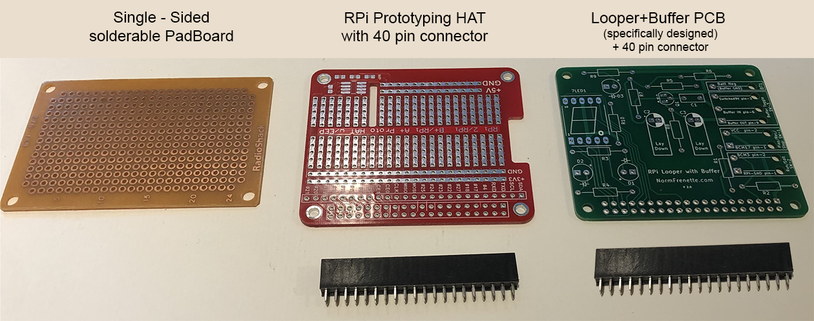
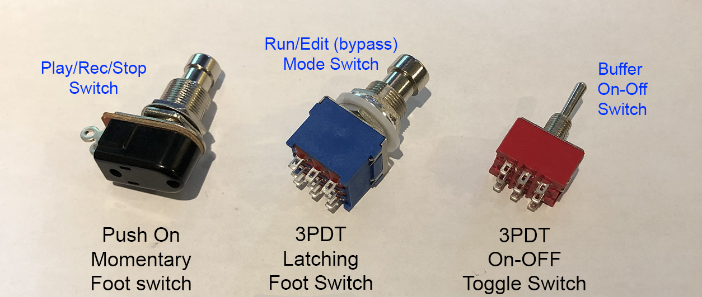

This document the various parts required to build the Raspberry Pi Looper.  

#### Raspberry Pi

I recommend the raspberry pi (RPi) version 3B+ or 4.  The RPi must have wifi and bluetooth (if you want to use the ios app - which is recomended).

Can you use a pi zero W?  Simply put - I am not sure.  If you have one lying around - please try it and let me know how it works.  
>The original pi zeroW had only one core.  The python program is written to use multi-cores as much as possible but the code will run on one core - meaning it will not crash.  The problem is that the audio sampling and playback could be affected by file operations (like saving to SSD card) - and may create studdering in playback.  At some point I intend to test this - and when I do I will update this.

What about the pi zero 2 W? I have not obtained one yet - but I think it should work just fine as it has 4 cores.  So go for it!

#### Power Supply for Raspberry pi:

I strongly recommend that you purchase a dedicated 5V 2.5 amp power supply that fits your raspberry pi.  Make sure it matches the connector on your selected RPi: the RPI 3B+ uses micro-usb plug whereas the RPi4 uses a usb-c connector.

I got the power supply for my RPI 3B+ at [Canakit](https://www.canakit.com/raspberry-pi-adapter-power-supply-2-5a.html).

For my RPI4 - I used a 4 port usb power supply with a usb-a to usb-c cable that I had lying around to charge my motorcycle helmet communicators.  It works fine.  I bet an ipad or tablet charger would work fine as well - just make sure you can put out 2.5 Amps for a RPI 3b+ or 3 Amps for a RPi 4 (as recommended on their website).

#### USB Sound Card:

Since we are trying to keep costs down - I recommend the following: Sabrent Audio Stereo Sound Adapter. It is less then $10 on Amazon and works fine.

Is it OK to use the RPi headphones?  I'll be honest, I did not have success with that option.  The output was noisy (buzzy) - and not good quality.

However, if you do not intend to plug in an instrument in the looper - you do not need a mic input like the sound card above.  You could go with just a sound card that has a headphone and/or speaker output - even maybe something from the Hi-Fi Berry line.  But in this case you will need a microphone that plugs into one of the usb ports.

#### Electronics

##### Through Hole BreadBoard
I strongly recommend getting the breadboard shown on the left - which is made for raspberry pi prototyping. 
I got mine at [Amazon](https://www.amazon.ca/gp/product/B07MCX54ZD/), but you can get them in many places, just search for "Breadboard PCB Shield Board Kit for Raspberry Pi".  The key is that it comes with a connector that fits the RPi pins, and labels that match the BCM naming.

You can use a more traditional breadboard like the one on the left. That is what I used for my first prototype (pics to come).  But in that case you need to get female to male raspberry pi connectors like these - and it's a bit more messy when you try to fit this into a case... 

>Note: You do not need the wires if you order the item on the left in the above picture (PCB Shield Board Kit for Raspberry Pi)

##### Light Emitting Diodes(LED)

##### Standard LED:

You will need one red LED and one green LED.
Additionally - for the buffer option:  buy an extra blue LED.

>note: the short leg of the diode, which is connected to the larger piece of metal (you can see inside the plastic) is the negative lead: connect it to GND (ground) in the [schematics](/Looper/How-to-Build-it-circuit-schematics/)

##### 7-segment LED

You need one  *common cathode* 7-segment LED. *(You only need one - even though I show 2 here for display)*

> The common cathode is important! It means the center pins are grounded.  If you got the other type  you would have to change the cuiruit schematics and the python code to turn on the segments.  I strongly recommend to get the common cathode - unless of course you have no problem modifying the schematics and the code.

##### Resistors

- Column "(no buffer) Looper indicates the quantities required when optional buffer is not built.
- Column Looper+Buffer inidcates the total quantities required when optional buffer is included in the build.

| Value (ohms) | (no buffer)Looper Qty | Looper+Buffer Qty |
|:------------:|:----------------:|:-----------------:|
|         330  |         3        |           3       |
|         1K   |         x        |           1       |
|         10K  |         2        |           4       |
|         18K  |         x        |           1       |
|        220K  |         x        |           1       |

##### Capacitors
 
Capacitors are only needed for the Looper + Buffer option

- 10 microFarad electrolytic - qty: 1
- 22 microFarad electrolytic - qty: 1
- 0.1 microFarad (100 nano) - qty: 1   / *use ceramic or tantalum or orange drop etc. (not electrolytic)*

##### Transistor

The circuit requires one **NPN BC549 transitor**. If you don't already have transistors - buy that one.  

Alternate transitor choice:  the BC550 is more or less a direct replacement.  

I use this transistor because it is a low noise transistor - which is useful in audio circuits.  There are many vintage circuit that use the 2n2222 as well. I have not tested that one - but if you have one of those instead, I would try it. 

##### Switches:

###### Play/Rec/Stop stomp switch

The switch used to control the Play, Record and Stop of the Looper is a momentary push button foot-pedal stomp switch.  It is important that you purchase a Push-type switch, which means that it is On while the button is pressed, and remains on as long as the button is pressed.

Search for Momentary Stomp Foot Switch like this one found at (amazon)[https://www.amazon.ca/gp/product/B077P1BFX9/]

Do not use the typical click-on click-off toggle stomp switch found on many guitar dedals.  It will not work with this design.  

###### Mode switch

**Looper With Optional Buffer**: Use a **DPDT On-Off-On toggle switch**.  This switch has a center postion where the switch is fully off.  There are 6 connectors underneath the switch.  I like to buy the Mini Miniature Toggle Switch type for this, like [these](https://www.amazon.ca/gp/product/B077P5F516/).

Looper **without** optional buffer:  If you are not including the buffer in the build you can use a simple **On-Off Mini miniature toggle switch** (only 2 connectors below the switch).  The only requirement is that the switch be of the toggle type, not the push type.  

Momentary push-On foot stomp switch on the left.  DPDT On-Off-On toggle mini miniature switch on the right.

#### Jacks and miscelanous

##### Buffer Jacks:

This is only needed if the buffer option is built.

The original design calls for two female 1/4 inch mono guitar jacks: one input, one output.  The idea is that the buffer is indepenet from the looper.  Having these two jacks means the Looper/buffer can be used in a pedal chain as a buffer only.

Feeding the buffer output to the sound card is done externally:  you need to buy - or construct - a small wire which has a 1/4 inch phono male plug at one end and the standard 3.5mm mono mic male plug at the other end - to connect into the sound card mic input.

Alternatively, you can buy a single 3.5mm male plug and wire leads to it.  Then solder the leads directly to the outputof the buffer circuit: you will have a wire hanging out the side of the looper though if you do not use the buffer.

Another alternative is to purchase a female 3.5mm mono jack to use as the output of the buffer.  In this case you can use a common [male to male 3.5mm wire](https://www.amazon.ca/gp/product/B071V7VW96/) to connect the output of the buffer to the sound card.  Note: you couls also by this, and cut it to length, and wire the leads per the second alternative...

##### 9V Battery Connector

This is only needed if the buffer option is built.

You need something to get the 9 V battery connected to the buffer cirsuit.  I find that these battery connectors are the simplest - but you may want to purchase a more complex product that comes with the battery holder as well.

#### Case:

You will need a case for your looper.  I intend to build a case that can be 3-D printed.  When I do, I will post the step file so you can print yourself a case as well.  

In the meantime - the only requirement is that the case cannot be made entirely of metal - because we need the wifi and bluetooth signals to get to the raspberry pi.

I have found that an iphone box is a very good prototype enclosure - because it is solid enough to be "stomped" upon as any guitar pedal.  Here is a pic of what I did:

