#### About
This  shows step-by-step details onf how to install the latest (as of Feb 2022) Raspberry Pi Operating System (OS) provided by the Raspberry Pi Foundation - to create a Raspberry Pi in [Headless](/Raspberry-Pi/Principles-What-is-Headless/#sectionTop) mode.  I use a macbook.  If you have a PC, the steps are similar (using the Raspberry Pi Imager is simplest).  I use terminal and linux commands on both mac and Raspberry Pi to set-up. 

> These are very detailed instructions written for somebody who has never seen Raspberry Pi before, and who has never used the terminal on the Mac, nor any Linux commands.  As a result, this post is long. But the actual amount of work is much shorter...

#### Requirements:
- A computer to download the OS and burn it unto an SD card - I use a MacBook
- A micro SD card - at least 16 GB.  I use 32 GB, sometimes 64GB - because I use the RPi to record music - and I need some space...
- An sd card reader if you do not have one integrated in your computer.  
- Access to wifi - Please have the wifi SSID and password.  The SSID is the name of the router that appears in the list of wifi when you want to connect with your phone or computer.  Write down both the SSID and get the password exactly.
- A raspberry Pi:  Model 3b+, 4 or pi zero 2 W. Basically you want a 4-core Arm chip + wifi & bluetooth.  
> the Pi zero W has wifi but only one core. For the Looper, I wrote the software to use multi-core, but the software will work on a single core - the issue is that it may not be able to handle all the work without affecting the live audio: I have not tested it on a single core yet...

#### On the MacBook - Get ready:
1. On your macbook - open your browser and go to: [https://www.raspberrypi.com/software/](https://www.raspberrypi.com/software/) and download the Raspberry Pi Imager. Click on "Download for MacOS". 
2. On the mac, navigate to your download folder using finder.  Double click on the file imager_xxx.dmg (where xxx is the version number).  On my mac - a window opens showing to drag the file unto the application folder like this:  
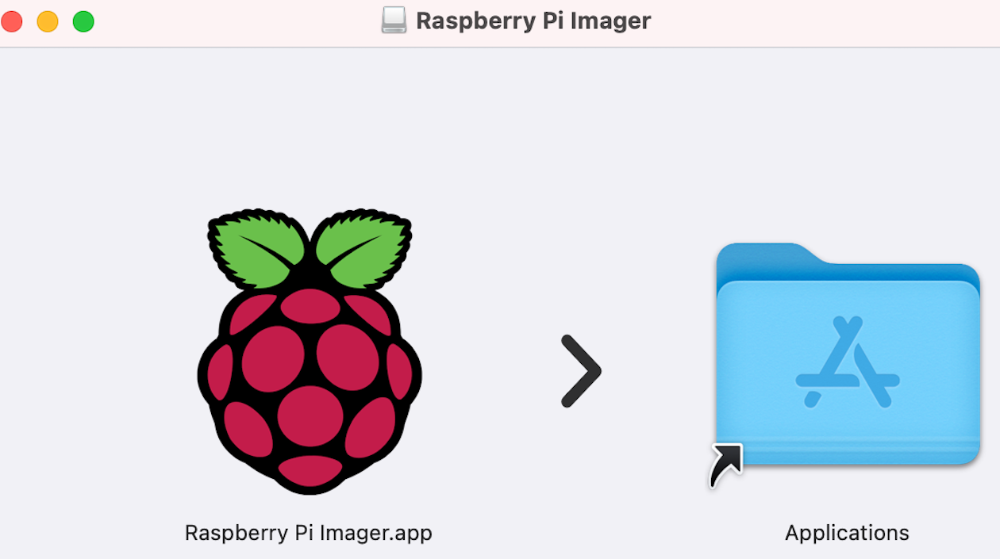  

Simply drag the Raspberry unto the shown folder in the window.  If you do not get this window, just drag the imager file unto your application folder directly in the finder.  Either way - this will install the Imager.  

3. Insert the micro SD card, into your card reader (which is connected to your mac).  

#### On the macbook - Select, Download and write the RPI OS to the SD card:
1. Go to your application folder, and launch (double-click) the Raspberry Imager. A window opens:  
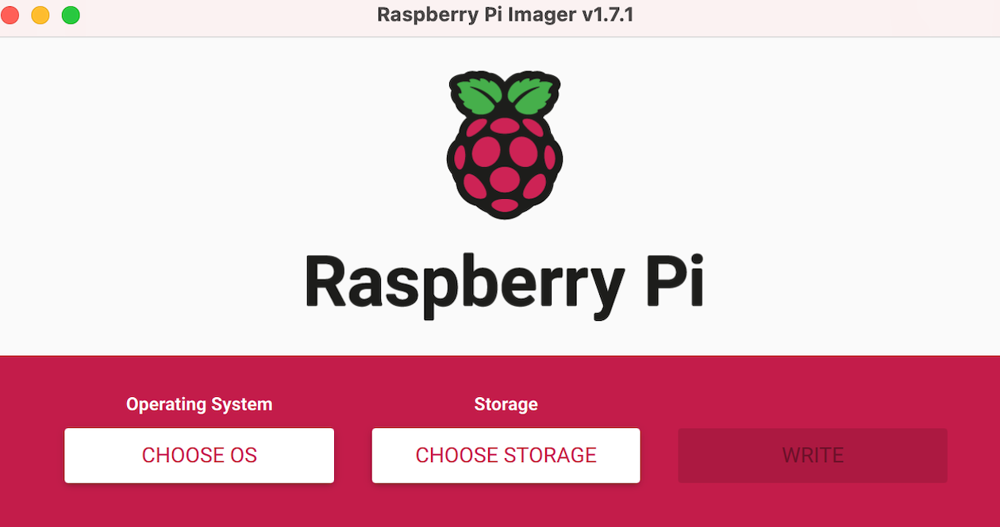  

2. Click on "choose OS". Scroll down if needed and select(click) option: Raspberry Pi OS (Other)  

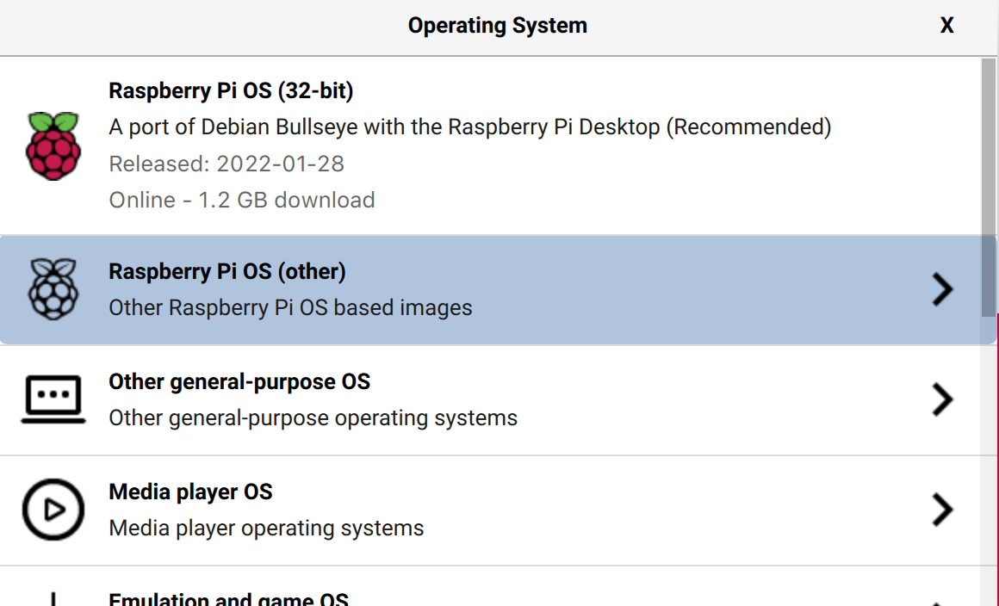  

3. Scroll down the list that appears and select the lite version - either 32 bit or 64 bit as you prefer.  If you are not sure stick with 32 bit for now. Click one of these:
    - Raspberry Pi OS lite (32-Bit)
    - Raspberry Pi OS lite (64-Bit) 

4. Upon selection, you are back to the imager window. Click on "CHOOSE STORAGE" (under the Storage label). A window appears with the name of the SD card. Click on it to select.
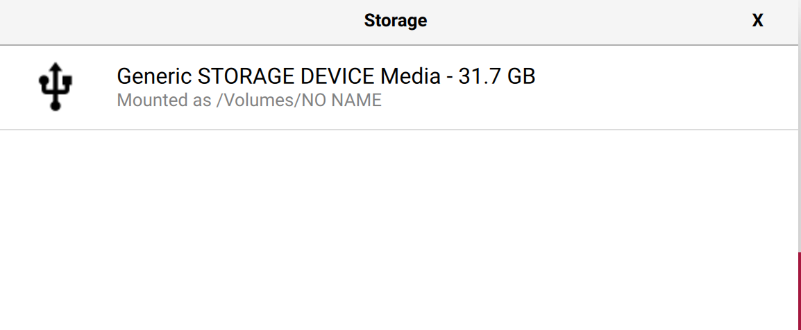  

> If you have a brand new SD card, you should see something like the name displayed above.  If you have a previously used SD card - you might see the name of the card appear.  Either way, once selected, all data on the SD card will be erased when you click "write" in the next step.
5. Clicking on the storage option brings you back to the imager window, where the WRITE option is now available (not dimmed as before).  Click on "WRITE", and then click "YES" to confirm that the SD card will be erased (before the RPi OS is copied unto it).
> The Imager will download the file for the selected Raspberry Pi OS lite unto the mac, then erase your sd card, write the OS to the card, and perform a verification.
6. You will see a status bar appear: wait for the writing to be complete, and the verification to be complete. (This takes a few minutes).
7. On my Mac - I am asked for the mac password in order to continue:  enter your mac password if required.
8. When complete, you will get a message telling you that the operation was complete and you may eject the SD card. Click " Continue", then physically remove the SD card from the card reader. You may close the Imager program as well (we are done with it).
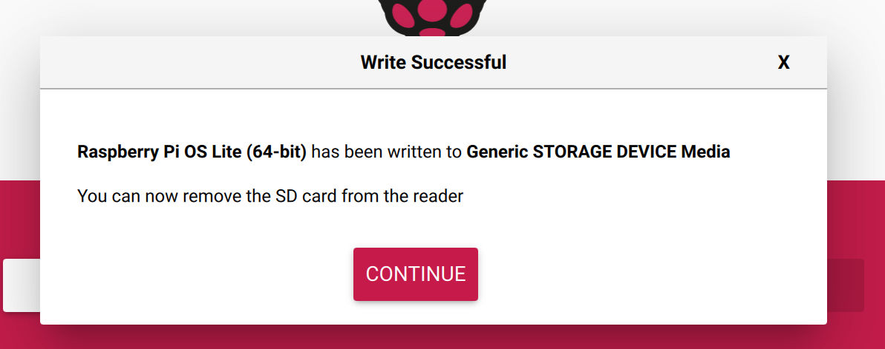  

#### ON the Macbook - Prepare the SD Card for RPi headless mode
At this point we will use the terminal - on the macBook - to set a few options on the SD Card, before we transfer it to the Raspberry Pi.  

1. Re-insert the SD Card into your mac.
2. To check it: look into finder - it will be listed as "Boot" under "Locations".
3.  Open a terminal window on the macbook. 
>  If you have never opened terminal before - I find the simplest way is to  hold the command key down and press the spacebar.  This brings up Spotlight - which is a search bar: type "terminal" and hit return. A terminal window will open.  It should look like this. 
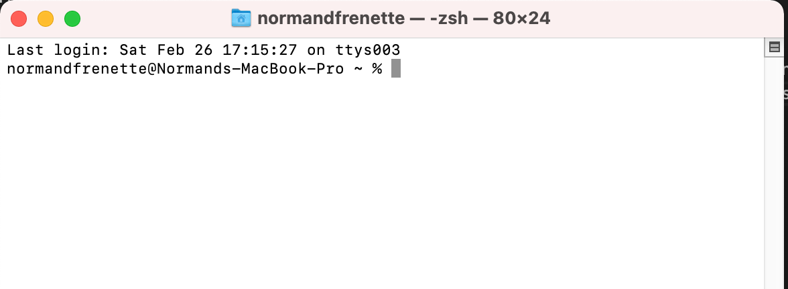  

> Note the % at the end of the last line in the terminal.  This is called the prompt. This is where you enter the commands.  Later you will open a terminal window on the Raspberry PI - it will be similar, but the prompt will be a $ sign.  It's a simple way to find out if you are working on the mac in terminal or on the Raspberry Pi: the prompt is different. 
4. At the prompt (%) - type the following to navigate to the SD card:
```
cd /volumes/boot
```
5. Create an empty ssh file on the SD card - type this command:
```
touch ssh
```
6. Create a wpa_supplicant configuration file, which will contain the log in info to your wifi - which will allow your raspberry pi to connect automatically upon first boot.  To create the file, open the "nano editor" - which will appear in the terminal - type this command:
```
nano wpa_supplicant.conf
```
7. Copy the text below (command-c) and paste it on the first line of editor - in the terminal window:
```
ctrl_interface=DIR=/var/run/wpa_supplicant GROUP=netdev
update_config=1
ap_scan=1
fast_reauth=1
country=CA
	network={
	ssid="Insert-SSID-here"
	psk="Insert-password-here"
}

```
8. Using the arrow keys, move to the line: ssid="Insert-SSID-here".  Erase (using backspace) the words *Insert-SSID-here* and type in the name of the SSID of your router (which you got in the requirements above).  Make sure the double quotes are there.  (do not remove them).
> you can't select/highlight words with the mouse in terminal like you do in microsoft word.  You have to move around using the arrow keys, and use backspace to erase and type what you want.
9. Again using the arrow keys, go to the password line. Erase the words: *Insert-password-here* and type in the password for the wifi SSID you selected (be careful - it is case-sensitive).  Again make sure you keep the double quotes around the password - do not erase the double-quotes.
10. At this point, your editor should look like this (I show a fake SSID and password as example):
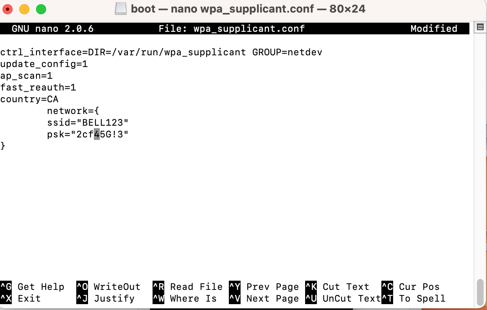  

11. Now save the file by typing control-o (hold control key and type letter "o"), and hit return.  Then exit the editor by typing control-x.
12. You are back at the prompt (%) in terminal.  To verify that the files were created - type the command:
```
ls
```
> ls is the linux command to list files in the current directory (which is /volumes/boot).  You will see a list of files that were placed on the sd card by the Raspberry Pi Imager.  Scroll through the list and you should see a file called ssh (no extension) and a file called wpa_supplicant.conf - which are the two files you created.

13. If you want to see the content of the wpa_supplicant.conf file, which you created, type the following command at the prompt:
```
cat wpa_supplicant.conf
```
14. At this point, we are ready to transfer the SD card to the Raspberry Pi.  Since we are on Mac - we have to eject the card, and to do so we have to ensure that terminal is not longer using it. Type the command:
```
cd ~
```
15. This brings back terminal to pointing at your home directory on the mac.  The SD card is now free to eject. Go to Finder and click the eject arrow next to the "boot" listing under Locations (should be right under your hard disk):
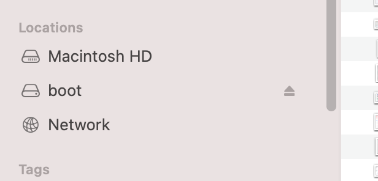

#### To the Raspberry Pi
1. Make sure your Raspberry Pi is unplugged (no power - red led is off).  
> If you have already built the Looper, take the Raspberry Pi out of the Looper case - so you can access the SD Card port.
2. Insert the SD card into the SD card port.  (at this point you can place the Raspberry Pi back into its enclosure)
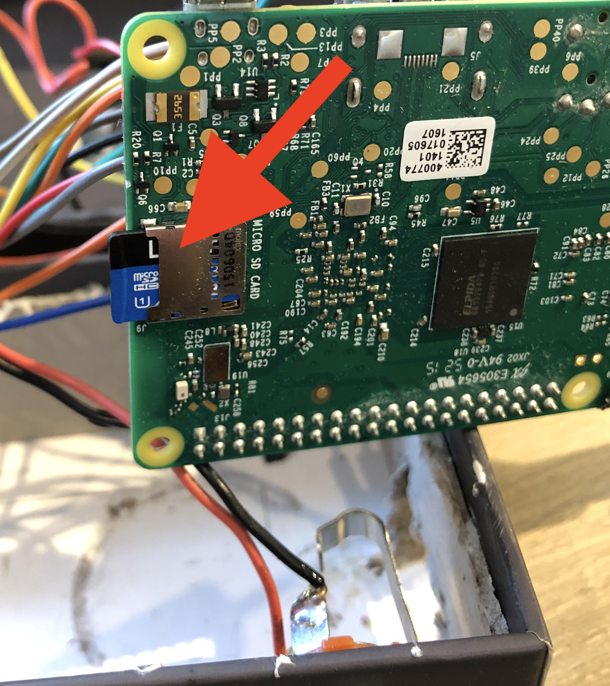
<center>sd card inserted in raspberry Pi - removed from Looper case</center>    <br\>
<center>(This is the underside of the RPi)</center>  

3. Connect power to the Raspberry.  
> The Raspberry Pi will now read the SD card and set-up the OS files and directories it needs. The last thing it will do is connect to your wifi. This takes a few minutes.
4. Wait until your raspberry Pi is connected to your wifi.  If you have access to your router control web page, you can access it using your computer - and wait to see a device called "raspberry pi" connected in the list of connected devices.  If you do not, wait 3-5 minutes until proceeding to the next step.
##### Now you will connect to the RPi using SSH from your Mac (via wifi).  On your Mac - go to the terminal window you previously opened.
5. If you have connected to a raspberry pi before with ssh from your mac, Run the following commands:
```
ssh-keygen -R raspberrypi.local
```
> This removes all keys belonging to the specified hostname from a known_hosts file. Don’t worry if you get a host not found error - the idea is to clear out any previous references to raspberrypi.local
		
6.  Now type in terminal (still on the mac):
```
ssh pi@raspberrypi.local
```
> You will be asked for a password - enter: raspberry
> Say "yes" to any warning or prompt that may come...  
7. You are now connected to the Raspberry Pi. Even though you are typing in a terminal window on the Mac - every command you type goes to the Raspberry Pi, and every response from the pi is displayed in the terminal window on the mac.  You will notice that the prompt is now a $ sign, indicating that you are in a terminal on the pi.

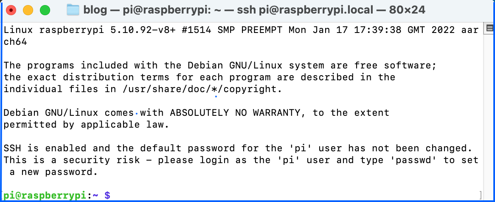

8. At this point, update the Raspberry Pi - type each command and then return after each command. wait for a command to be completed before typing the next one:
```
$ sudo apt update
$ sudo apt full-upgrade
```
Enter Y when prompted.  

9. Set-up a Raspberry Pi name, password and expand file systems:
    1. Type the following command to configure the Raspberry pi:
    ```
    sudo raspi-config
    ```
    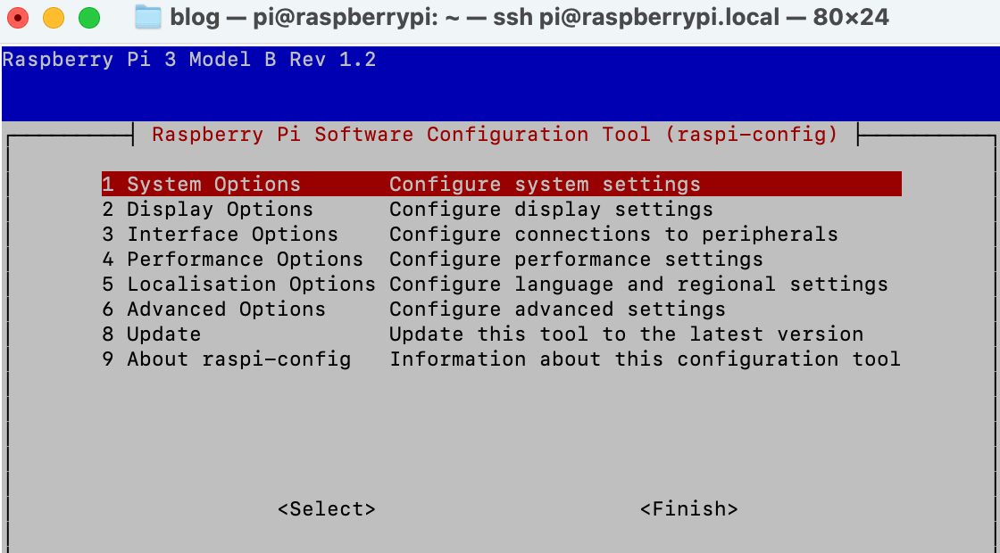

    2. In the menu that appears, using the arrows on your keyboard to navigate up and down - select (hit return) option: **1. System settings**, then select option: **S4 Hostname**.<br/>Click OK - for the warning, then erase (backspace) the raspberrypi name that appears and enter a new name for your pi. In this example, we enter the name ***looper64*** (since I installed the 64 bit version of the OS - and I am using this Raspberry Pi to build a looper).

    3.  Back to the main menu.  Select **1. System Settings** again, and then select option: **S3 password**.<br/>Click OK, and enter the password you want . You will be asked twice to confirm.  Please note the password somewhere safe.  When done click OK to return to main menu

    4. Back to main menu, select option: **6. Advanced Option**, then select option: **A1 Expand File system**. When done, click OK.
    5. Back to the main menu - Use the right-arrow to select "**Finish**" - then click return. You will be ask if you want to reboot now. Select "**Yes**".  The Raspberry Pi will now reboot.
    > You will notice that the terminal window on your mac no longer says "raspbery Pi". You are back into your mac - with the % prompt.  We will use this in the next step.

##### Setting up Raspberry Pi with authentication key from the Mac.
At this point, after the Raspberry Pi has rebooted, you could reconnect using the ssh command above - however using the new name and password (ssh pi@looper64.local).  However, every time you want to connect to the Pi - you would need to enter the password.  There is a simpler way: By connecting using a private-public key pair created on your mac.  
1. Go to the terminal window you opened in the previous steps.
2. Check if you have already created a private/public key on your mac.  Type these two commands:
```
cd ~/.ssh
ls
```
> You may get a warning that.ssh does not exists. - if that is the case you need to generate the keys
3. If .ssh exists, ls will return a list of files.  look to see if a file named id_rsa.pub exists.  If it does - skip the next item (#4). If not, you need to create the keys.
4. If you need to create the keys: Type the command:
```
ssh-keygen 
```
5. At this point, you have a private/public key on the mac.  We need to transfer it to the Raspberry Pi (which has rebooted and is waiting ). Type these two commands, one after the other:
> The command uses the name of the Raspberry Pi which we just created (looper64).  If you used a different name, replace "looper64" in the command below by the name you selected.
```
cd ~/.ssh
ssh-copy-id pi@looper64.local
```
> You will be prompted for the password you created in raspi-config on the raspberry pi above.
> You then receive a message that they key was added. 
6. You can now log in without having to enter the password. Type this command: (replace with correct name if not using looper64)
```
ssh pi@looper64.local
```
> You will now get the familiar Raspberry Pi $ sign prompt - indicating that your terminal window is acting directly on the raspberry pi.

#### That's it. You're done

You have installed the latest version of the Raspberry Pi OS lite on your RPi, and have set up a way to control it in headless mode - directly from your computer - without having to connect a monitor, keyboard and mouse.

At this point you can install the software for the [Looper](/Looper/Software-Installation-RaspberryPi-manual/#sectionTop), or for the [Set Wifi via Bluetooth](/Set-wifi-via-bluetooth/Installation-RaspberryPi-automatic/#sectionTop) app, unto your raspberry pi.

Or you can simply start developing your own code for your own project.  Have fun!


