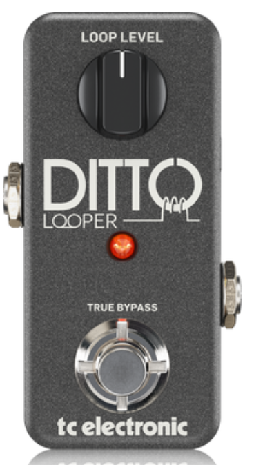
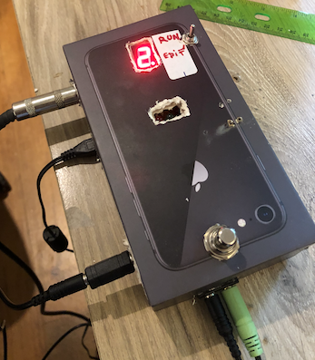
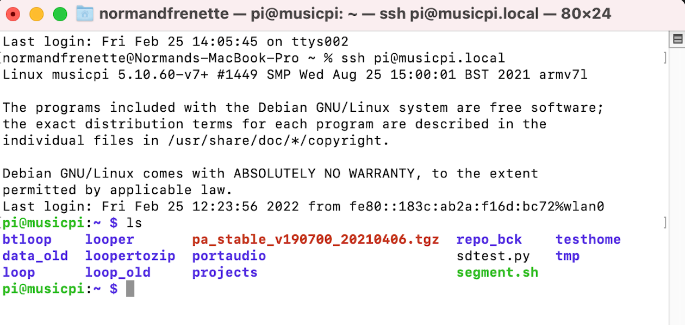

#### About
This article discusses what it means to run a Raspberry Pi in headless mode, and why you would want to do this.

#### The typical Raspberry Pi computer - desktop version

The Raspberry Pi is a computer - just like a desktop PC:  
- it has an HDMI port - to connect a monitor
- it has USB ports, to connect a mouse and keyboard, or even a video camera or sound card (all USB).
- It runs Linux as an operating system (Debbian/Raspbian to be precise) - instead of Windows.
- It can run a browser, people install Open Office for productivity etc.  
> Note:  is possible to install different versions of Linux or even real-time operating systems - but I'm not covering this here.  

So, it is possible to install a "desktop" version of the operating system, which you get from the [Raspberry Pi Foundation people](https://www.raspberrypi.com/), and use the Raspberry Pi as you would any desktop computer. Not bad for an initial investment of $35-$45!

#### So what is this headless thing?

Basically, a headless Raspberry PI is not connected to a monitor, a mouse and a keyboard.  It is - as they say - headless.

#### Why use a headless Raspberry Pi?

Well...  I already have a MacBook and some older Windows laptops. I even have an old pentium desktop I built. And let's be honest, I am kind of fond of the power of MacBook's applications and Microsoft Office - so I'm not keen to move to the Linux world for productivity.

The attraction of the Raspberry Pi to me is that I can build "appliances" as some people call them:  projects, where the Raspberry Pi is in an enclosed box, connected to something that is being controlled by the Raspberry Pi.

The Raspberry Pi is a full computer that also has the GPIO (General Purpose Input Output) pins.  This makes very simple to connect switches, knobs, LED etc. to control any "appliance" built it.  

In my case - I wanted to build a guitar "**Looper**" pedal. Something that looks like [this](https://www.tcelectronic.com/product.html?modelCode=P0DD4):

My version is a bit bigger to fit a raspberry Pi 3b+ inside.  Like most guitar pedals, it has ports to plug in the guitar and the amplifier.  It has buttons and LED.  It has a power connection.  I put the first prototype inside an iPhone box:

What the Looper inside its case does not have, is access to the HDMI and USB ports: So how can I control the Raspberry Pi, write software unto it, without being able to connect a keyboard, mouse or monitor?

***Time for the headless Raspberry Pi.***  

A Raspberry Pi is said to be ***headless*** when it does not have a monitor, keyboard and mouse connected to it. Instead, I use a separate computer to communicate with, and control the Raspberry Pi.  From this computer, I can issue Linux commands, write code, run/debug programs as if I was connected to the Raspberry Pi with a keyboard, mouse and monitor.  In other words, I use the keyboard, mouse and monitor of another computer (my MacBook) to control a ***headless** Raspberry Pi. 

#### How does it work?

I use my MacBook Pro laptop to control the Raspberry Pi.  I do not use a graphical  windows interface, mouse etc. I use the "terminal" - on the mac  to send commands to the Raspberry Pi.  Whatever command is run, if it elicits a response from the Raspberry Pi - the response is displayed in the terminal window on the mac.  I use a method called SSH - which creates a secure link to the Raspberry Pi - allowing for authentication.  

The MacBook and the Raspberry Pi are connected to my home Wi-Fi router, and they communicate over Wi-Fi. Note that the Raspberry Pi could be connected to the MacBook via USB instead of Wi-Fi, but my Raspberry Pi is inside an enclosure that does not expose the USB port. So, I use the Wi-Fi.

>Note: although I cover how to use a MacBook Pro here - all of this can be done with a PC using Windows.  You just have to get the correct programs (Putty...) to interface to the Raspberry Pi.  Google can be your friend here...

If you are already familiar with Linux - you probably have used the command line to control a Linux computer via terminal. This is what we will do here. If you come from the Microsoft world - you may be familiar with DOS commands - and the cmd window - it's the same principle - but because the Raspberry Pi runs Linux - we use Linux commands.  

Here's is an example on the mac, where I opened a terminal window, I connected to my Raspberry Pi using SSH, and issued a "ls" command from the MacBook (ls: list the files in the current directory). Linux listed the files - and I see them displayed in (the MacBook's) terminal window:

#### So how do we do this?

Basically, I install the headless version of the Raspberry Pi Operating system (called OS lite) on the Raspberry Pi SD card, and set it up to speak to the Wi-Fi router.  Then I use SSH and some authentication stuff to connect to the Raspberry Pi from the mac.  
> See the detailed step by step [OS lite installation and SSH instructions](/Raspberry-Pi/Installation-RPi-OS-Lite-Headless/) on how to do to this.

#### What about programming in the Raspberry Pi?

After all, the idea is to have control of the Raspberry Pi from the MacBook - to create programs that turn the Pi into the appliance we want (in my case - a looper).  The code has to be developed and run on the Pi.

Fear not developer tools such as IDE are available that run on the mac but all the code written lives on the Raspberry Pi, and runs on the Raspberry Pi.  The IDE running on the mac allows for code writing, linting, debugging, just as if we were doing this on the Raspberry Pi that has its own monitor, keyboard and mouse.

I will write a post soon on how to do this.  Meanwhile, if you are impatient: Google it. I use VSCode, Python and bash. It works like a charm.
