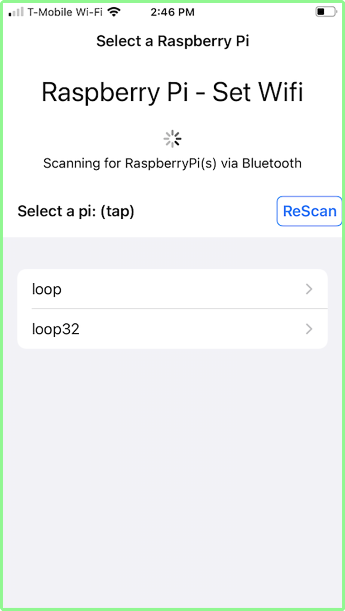
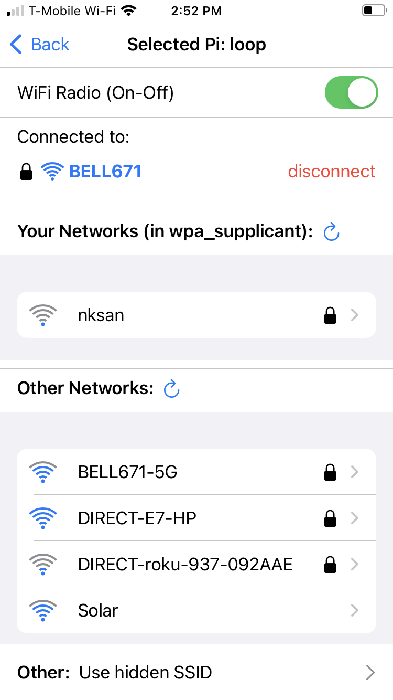
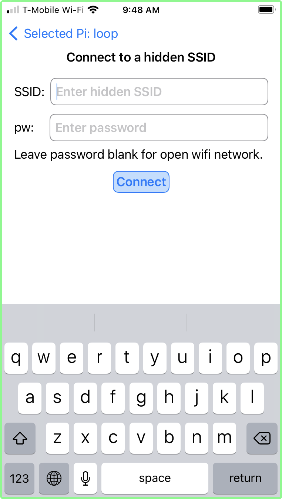
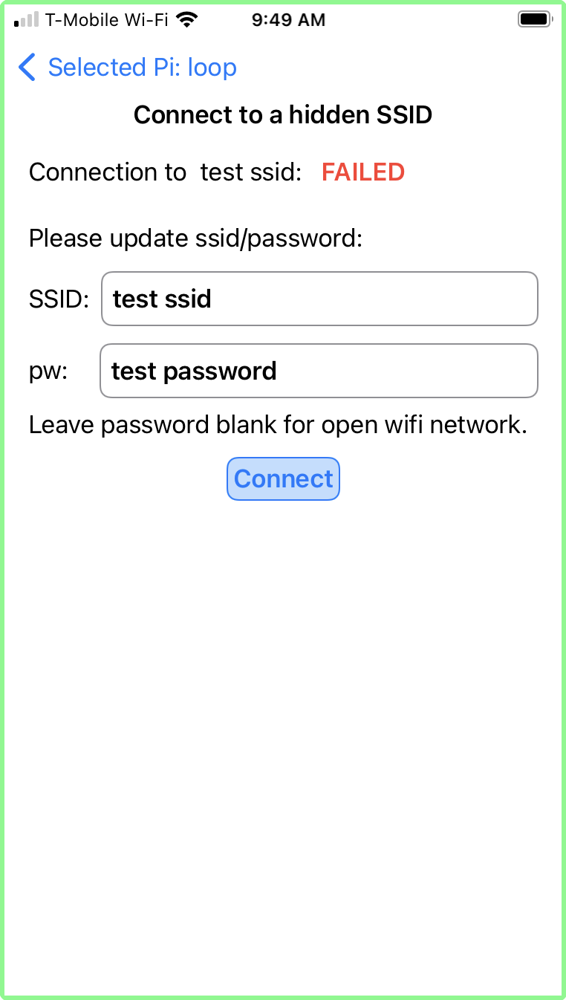
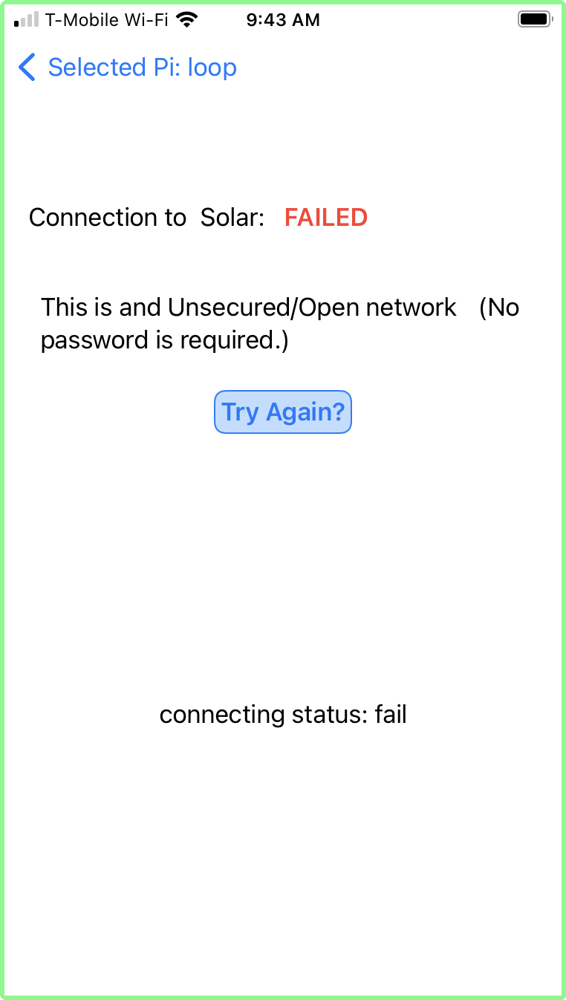
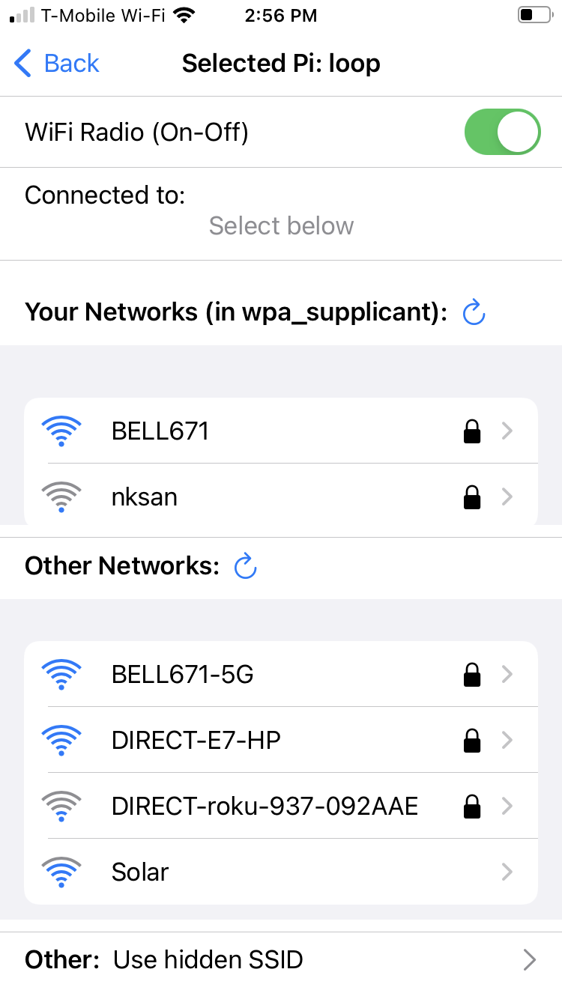
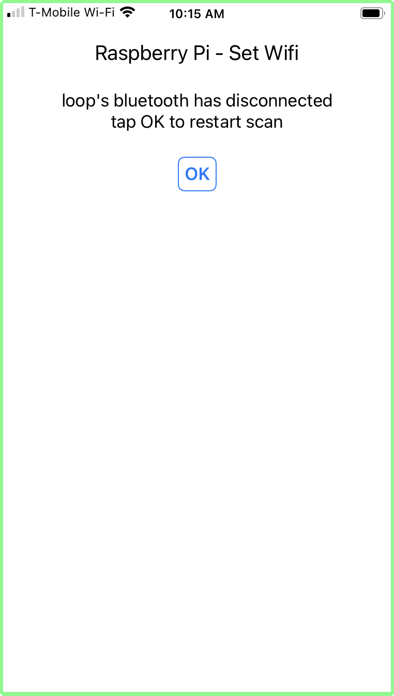

#### About  
Set the wifi on your [Headless](/Raspberry-Pi/Principles-What-is-Headless/#sectionTop)Raspberry Pi via the iphone app.  The app connect to the RPi over Bluetooth (i.e. the RPi is not connected to wifi).
 
The typical use cases are:
1. You have a headless Raspberry Pi working at home - and you take it to a friends house or a public place where you need to connect it to a yet unknown wifi network available there.  
2. You have one or more headless Raspberry Pi at home (for example: home automation or home theater), and you change your home network SSID (new router).  
In all cases, you do not have the ability to connect a monitor/mouse/keyboard to the Raspberry Pi to edit the wpa_supplicant.conf file and add the new network. Instead, you can use this iPhone App.

#### Requirements - what you need:
1. A Raspberry Pi with integrated wifi and bluetooth.
2. Installed Python Bluetooth Program on the Raspberry Pi.  You can use the simple [automated](/Set-wifi-via-bluetooth/Installation-RaspberryPi-automatic/#sectionTop) installation procedure, or you can install the code and it's dependencies [manually](/Set-wifi-via-bluetooth/Installation-RaspberryPi-manual/#sectionTop).
>*This code **must be installed** on the Raspberry Pi before you attempt to connect to it with the iPhone app.  This code "speaks" via bluetooth to the iPhone app and manages the process of connecting the Raspberry Pi to the wifi network selected via iPhone app.*

#### Basic Principles: Everything happens on the Pi

The **BTBerryWifi** iPhone App provides a window to your Raspberry Pi. It displays the wifi networks (SSID) that the Raspberry Pi sees - not those that the iPhone sees.
>Older Raspberry Pi have weaker wifi chips than the newest iPhones.  So it is  possible that your iPhone will see more (faint) networks then the Raspberry Pi can see. Once you are in the app - you will only see those wifi networks that the Raspberry Pi sees and is able to connect to.
Once you select a network, the iPhone sends this selection to the Raspberry Pi, over Bluetooth.  It is the python code on the Raspberry Pi that  handles the connection to the requested wifi network.
The iPhone app is aware if the Raspberry Pi has previously connected to the selected network. If it has not, it will ask for a password before sending the requested network name and password over Bluetooth to the Raspberry Pi.  
>Note that passwords are not encrypted before being sent to the Raspberry Pi. Risks are low: it is bluetooth, an eavesdropper would have to be standing very close to you with a bluetooth traffic sniffer to get the password - which you probably were just given by your friend anyway...

#### User Guide - with screenshots:

Start or reboot your Raspberry Pi.  The python code has a default timeout of 15 minutes after reboot. You must connect with the iPhone app during this time window.
>The timeout duration can be adjusted using the configuration file that came with the python code - on the Raspberry Pi.  

Launch the **BTBerryWifi** app.  The **Select Raspberry Pi** screen appears.  If you have more than one Raspberry Pi nearby (with the python program installed) - you can select the Raspberry Pi you want. In this example, there are two Raspberry Pi nearby, one named **loop** and one named **loop32**.   Use the ReScan button to refresh the list (older RPis are slower to appear...).  

Tap the Raspberry Pi you want. (In this example, *loop* was selected).  The **connecting** screen appears (with a *"spinner"* icon), indicating that the iPhone app is connecting via bluetooth to the selected the  Pi.  After connection is established (a few seconds typically), the **AP Search** screen appears.  This indicates that the Raspberry Pi is scanning for wifi networks, and sending the list to the iPhone app via bluetooth.  

Once the list of AP found by the Raspberry Pi is received, the App displays the **List of Networks** screen, from which you can select a wifi network.

- The top part shows the selected Raspberry Pi (in this case: loop).  The Back arrow returns to Raspberry Pi selection.  
- The next section indicates that the Raspberry Pi wifi radio is **On**.  It can be toggled to off (see below)
- The next section shows the Access Point (AP) wifi network to which the Raspberry Pi is currently connected:
    - the lock icon indicates this is a secure network.
    - the wave icon shows the strength of the signal for this Access Point.
    - the red *disconnect* button can be used to disconnect the Raspberry Pi from this network.
- the **Your Networks** list indicates any AP wifi network that is listed in the Raspberry Pi wpa_supplicant.conf file, which is seen *live* by the Raspberry Pi.
- the **Other Networks** list all AP seen by the Raspberry Pi - which are **not** known to the Raspberry Pi (i.e. not in the wpa_supplicant.conf file)
- Finally the last line allows you to connect to a hidden SSID AP: that is an AP that does not broadcast its SSID: if you tap this, you will be able to enter the AP SSID and its password to connect to it.

##### Connecting to "Other Network":

Let's connect to "Other Network" **nksan** (last in the list in above screen shot).  Tap this network in the list.  Since **nksan** had a "lock" icon, it is a secure network: a screen asking for the password appears.
>Note: tapping the blue arrow labelled "Selected Pi:" will return to the **List of Networks** screen.

 

Tap the password box and the keyboard appears. 

 Enter the password and tap **connect**.  A waiting screen with "spinner" indicates that the Raspberry Pi is attempting to connect to the selected AP (nksan) with the supplied password.  It can take up to 15 seconds to connect.

 

Once connected, the **List of Networks** screen is displayed.  You can see that the **nksan** is now connected - meaning that the Raspberry Pi successfully connected to the nksan wifi network.  

>Note that the previous network Bell671 is no longer connected, and is listed under **Known Networks**.

##### Connect to "Your Networks"

Let us reconnect to **Bell671** which is a known network. Simply tap on the desired network (Bell671 in this example).  A spinner will be displayed as above, and when the connection is established, the **List of Network** screen is displayed, this time with Bell671 shown as connected.

>The earlier successful connection to **nksan** means that this network was added to the wpa_supplicant.conf file via the python program on the Raspberry Pi. It is therefore now shown under **Known Networks**.  

###### Other Network - secured - failed to connect:

If you have failed to connect, it is likely because the password is wrong (although there are rare cases where the network refuses connections for other reasons which cannot be addressed with this App).

For example, we have attempted to connect to ***Bell671-5G*** listed in **Other Networks**, but have entered a bogus password.  The Raspberry Pi attempted to connect and failed. The failure screen is displayed:

>At this point, you can re-enter the password, or tap the top-left blue arrow labelled **Selected Pi** to return to the **List of Networks** screen.

##### Connecting to a hidden SSID

Some Access Points are configured to **not** broadcast their SSID (i.e.  name).  In this case it is not found by the Raspberry Pi and is not displayed in the list of network.  However, you can still connect to it if you know the exact name of the hidden (SSID) network and the password.

Tap the last row at the bottom of the screen labelled: **Other:** Use hidden SSID.  A screen appears that allows you to enter both the name of the network (SSID) and the password.

Enter the required information and click connect.  The familiar spinner appears, and if successful, the **List of Network** screen will appear, showing the hidden SSID's name as connected.  

>Note that now that you have connected to this hidden SSID, the Raspberry Pi is aware of its presence, and if you disconnect from it, this hidden SSID's name will actually be listed under known networks - but only for the duration of this session.

###### hidden SSID - failure to connect

In this example, a fake SSID name and password was entered.  has a result, the Raspberry Pi could not connect and displayed the corresponding failure screen.

>You can re-enter correct information and connect, or tap the top-left blue arrow labelled **Selected Pi:** to return to the **List of Networks** screen

##### Connecting to an open Network

An open network is not secured, and does not need a password. These are often found in coffee shops or airports for example. They will appear in the **Other Networks** list.  They do not have a lock icon.  For example, Solar, below is an open network.

To connect, tap the name of the network.  Since a password is not needed, the Raspberry Pi will attempt to connect immediately, and the connection spinner seen above will be displayed.  If the connection is successful, the familiar **List of Network** will be displayed with the selected open network connected.

###### Open network - failure to connect:

If the Raspberry Pi fails to connect the following screen will be displayed.  

> At this point, you do not have many options. The Raspberry Pi has failed to connect.  There is no password to re-enter.  You can only try to connect again or go back to the **List of Network**.  

##### Turning off the Raspberry Pi Wifi Radio

Using the app it is possible to turn off the wifi radio on the Raspberry Pi. This is sometimes used to save battery on the RPi.  On the **List of Network** screen, simply toggle (*slide left*) the switch labelled **Wifi Radio (On-Off)**.

When the RPi wifi radio is off, the following screen will be displayed:

>Note that although the wifi radio is off, the bluetooth radio is still functioning and the iPhone app is still connected to the Raspberry Pi.  You can turn on the wifi on the RPi by toggling the switch back to On (*slide right*).  

Upon turning the radio **on**, the **List of Networks** screen appears again.  However, the RPi is not connected to a network.  

You must select one of the network to reconnect the Raspberry Pi to a wifi network.

##### Raspberry Pi Bluetooth failure / Python program timeout

It has been observed that sometimes the Raspberry Pi Bluetooth connection drops - which essentially disconnects the iPhone from the RPi. In this case, the following screen is displayed, as a warning.

Tapping OK will re-start the scanning for Raspberry PIs - as per the entry screen above.  If the Raspberry Pi bluetooth is functioning, you will be able to connect.
>Note that if the iPhone app was left unattended for the default timeout of 15 minutes, the Raspberry Pi Python program will have shutdown, and you will not be able to reconnect to the Raspberry Pi until it is rebooted.  However, the iPhone App can remain open. Simply tap the **ReScan** button after the Raspberry Pi has booted up to reconnect.