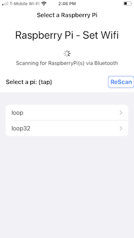
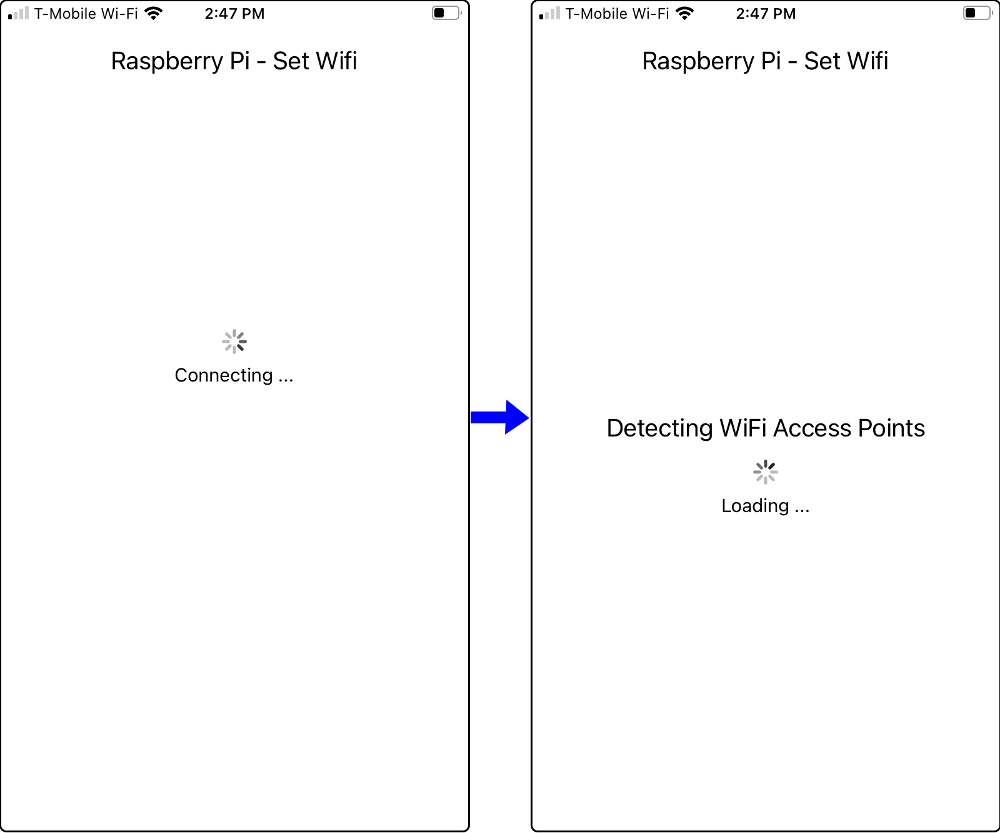
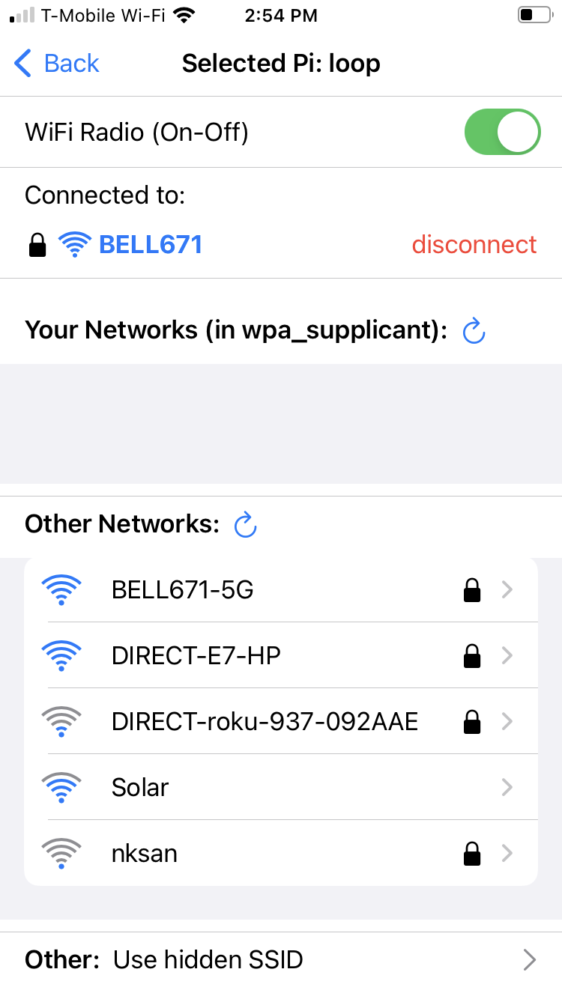
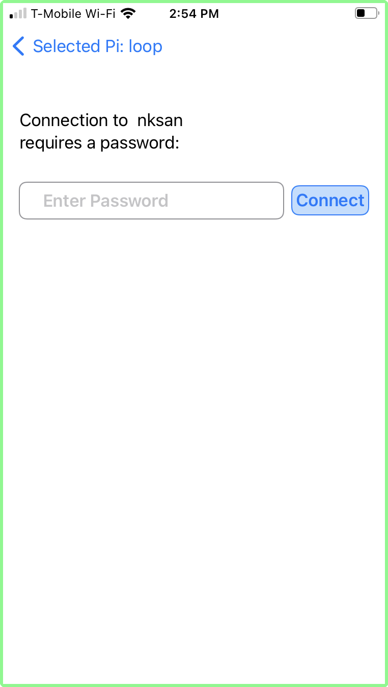
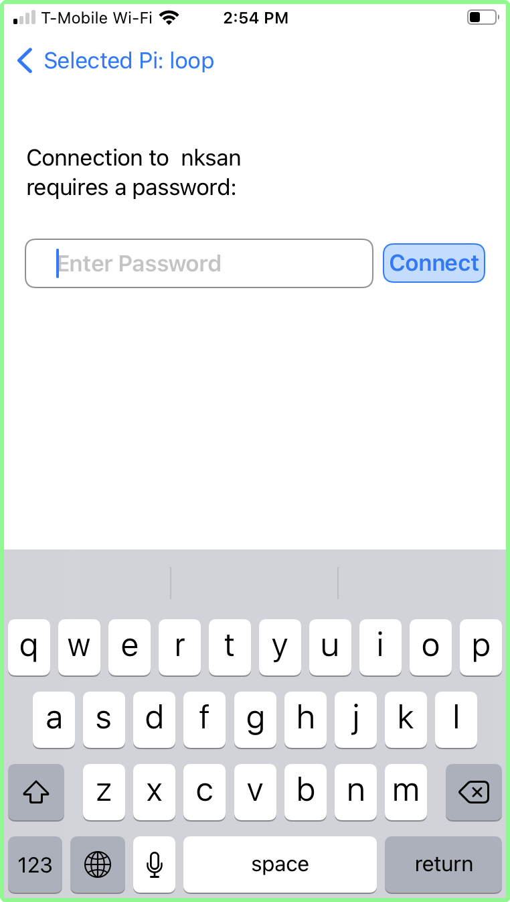
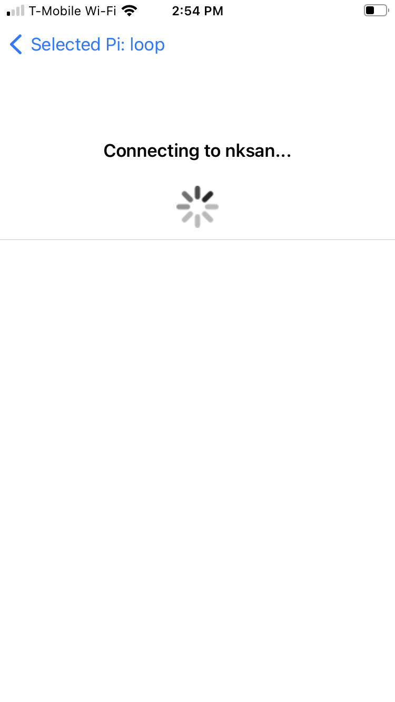

#### About  

The iphone app **BluetoothBerryWifi** allows you to select a wifi network (SSID)  for your [Headless](/Raspberry-Pi/Principles-What-is-Headless/) Raspberry Pi.  
The typical use cases are:
1. You have a headless Raspberry Pi working at home - and you take it to a friends house or a public place and you need to connect it to the wifi network there.  
2. You have one or more headless Raspberry Pi at home (for example: home automation or home theater), and you change your home network (new router).  
In any case, you do not have the ability to connect a monitor/mouse/keyboard to edit the wpa_supplicant.conf file to add the new network. Instead you can use this iPhone App.

#### Requirements - what you need:
1. A Raspberry Pi with integrated wifi and bluetooth.
2. Installed Python Bluetooth Program on the Raspberry Pi.  You can use the simple [automated](/Set-wifi-via-bluetooth/Installation-RaspberryPi-automatic/) installation procedure, or you can install the code and it's dependencies [manually](/Set-wifi-via-bluetooth/Installation-RaspberryPi-manual/).
>This code must be installed on the Raspberry Pi before you attempt to connect to it with the iphone app.  This code "speaks" via bluetooth to the iphone app and manages the process of connecting the Raspberry Pi to the wifi network selected using the iphone app.

#### Basic Principles: Everything happens on the pi

The **BluetoothBerryWifi** iphone App provides a window to your Raspberry Pi. It displays the wifi networks (SSID) that the Raspberry Pi sees - not those that the iphone sees.
>Older Raspberry Pi have weaker wifi chips than the newest iphone.  So it is quite possible that your iphone will see more (faint) networks then the Raspberry Pi can see. Once you are in the app - you will only see those wifi networks that the Raspberry Pi is able to connect to.
Once you select a network - all the iphone does is send this selection to the Raspberry Pi.  It is the python code on the Raspberry Pi that will handle the connection to the requested wifi network.
The iphone app however, is aware if the Raspberry Pi has previously connected to the selected network. If it has not, it will ask for a password before sending the requested network name and password over Bluetooth to the Raspberry Pi.  
>Note that passwords are not encrypted before being sent to the Raspberry Pi. Since it is bluetooth, an eavesdropper would have to be standing very close to you with a bluetooth traffic sniffer to get the password - which you probably were just given by your friend anyway...

#### User Guide - with screenshots:

Start or reboot your Raspberry pi.  The python code has a default timeout of 15 minutes after reboot. You must connect with the iphone app during this time window.
>The timeout duration can be adjusted using the configuration file that came with the python code - on the Raspberry Pi.  

Launch the **BluetoothBerryWifi** app.  The **Select Raspberry Pi** screen appears.  If you have more than one Raspberry Pi nearby (with the python program installed) - you can select the Raspberry Pi you want. In this example, there are two raspberry pi nearby, one named **loop** and one named **loop32**.   Use the ReScan button to refresh the list (sometimes different pi's appear at various speed...).  

Tap the Raspberry Pi you want. (In this example, *loop* was selected).  The **connecting** screen appears (with a *"spinner"*), indicating that the iphone app is connecting via bluetooth to the selected raspberry pi.  After connection is established (a few seconds typically), the **AP Search** screen appears.  This indicates that the Raspberry Pi is scanning for wifi networks, and sending the list to the iphone app via bluetooth.

Once the list of AP found by the Raspberry Pi is received, the App displays the **List of Networks** from which you can select a wifi network.

- The top part shows the selected Raspberry Pi (in this case: loop).  The Back arrow returns to Raspberry Pi selection.  
- The next section indicates that the Raspberry Pi wifi radio is **On**.  It can be toggled to off (see below)
- The next section shows the Access Point (AP) wifi network to which the Raspberry Pi is currently connected:
    - the lock icon indicates this is a secure network.
    - the wave icon shows the strength of the signal for this Access Point.
    - the red *disconnect* button can be used to disconnect the Raspberry Pi from this network.
- the **Your Networks** list indicates any AP wifi network that is listed in the RAspberry Pi wpa_supplicant.conf file, which is seen *live* by the Raspberry Pi.
- the **Other Networks** list all AP seen by the Raspberry Pi - which are **not** known to the Raspberry Pi (i.e. not in the wpa_supplicant.conf file)
- Finally the last line allows you to connect toa hidden SSID AP: that is an AP that does not broadcast its SSID: if you tap this, you will be able to enter the AP SSID and its password to connect to it.

Let's connect to "Other Network": **nksan** (last in the list in above screen shot).  Tap this network in the list.  Since **nksan** had a "lock" icon, it is a secure network: a screen asking for the password appears.
>Note: taping the blue arrow labelled "Selected Pi:" will return to the List of Networks.

 

Tap the password box and the keyboard appears. 

 Enter the password and tap **connect**.  A waiting screen with "spinner" indicates that the Raspberry Pi is attempting to connect to the selected AP (nksan) with the supplied password.  It can take up to 15 seconds to connect.

 

